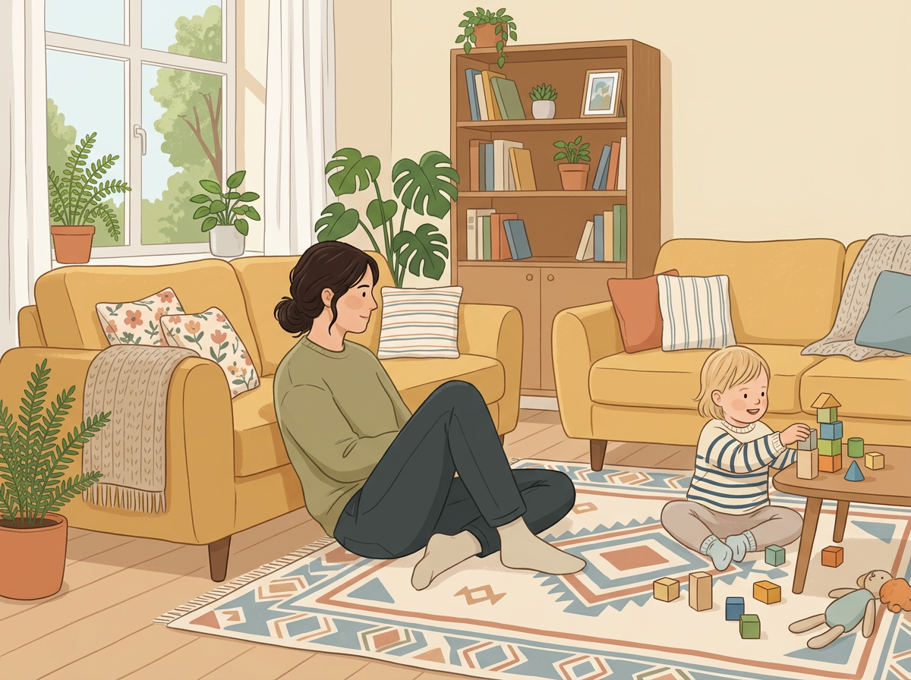
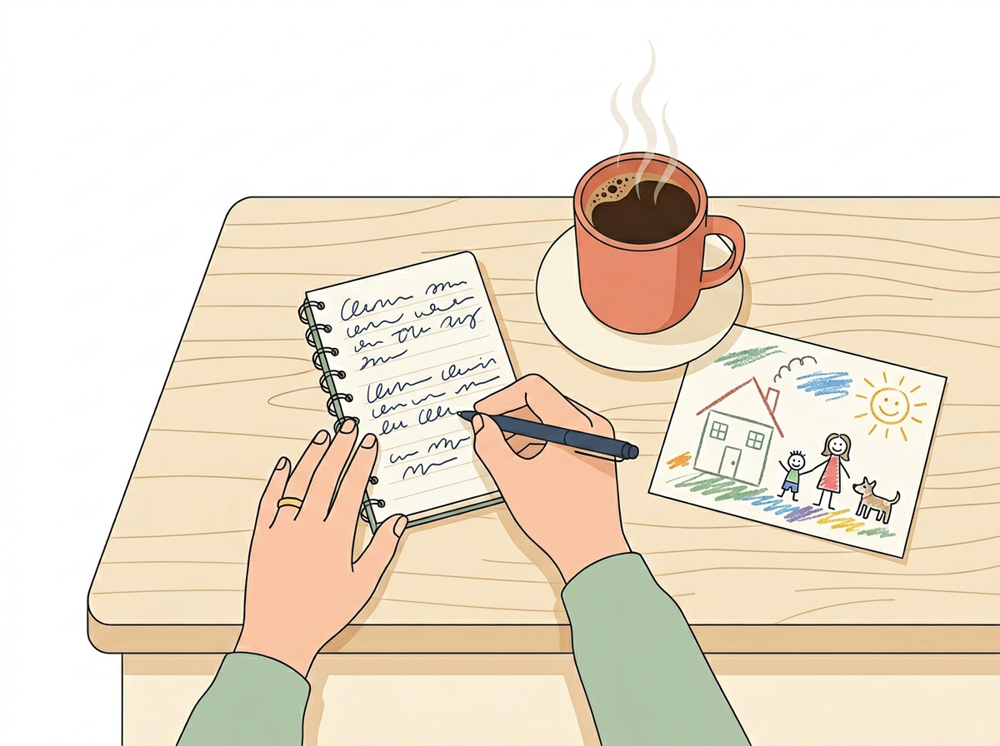

# Chapter 1: The Observer Parent Method

## Part 1 — How to Watch Without Interfering

---

Here's a question that might surprise you:

**When was the last time you watched your child — really watched — without saying a word?**

Not while helping with homework. Not while refereeing a sibling argument. Not while half-watching from behind your phone. I mean a full, quiet, focused few minutes where you just... observed.

If that feels unfamiliar, you're in good company. Most parents spend their days in *management mode*: directing, correcting, scheduling, solving. And that makes sense. There are lunches to pack and shoes to find and someone is always about to put something weird in their mouth.

But management mode has a blind spot. When you're busy running the show, you miss the small, unscripted moments where your child's natural strengths are on full display.

**The Observer Parent Method fixes that.** And it takes less time than scrolling your phone before bed.

---

## The Difference Between Watching and *Seeing*

You watch your child every day. You watch them eat breakfast, ride their bike, argue about bedtime. That's watching.

*Seeing* is different.

Seeing is when you notice that your four-year-old doesn't just play with blocks. She sorts them by color before she builds. Every single time.

Seeing is when you catch your seven-year-old explaining the rules of a made-up game to three other kids in the backyard, and you realize he's been organizing group play like that for years.

Seeing is when your toddler ignores the expensive toy and spends twenty minutes opening and closing a cardboard box, and instead of redirecting him, you wonder: *What is he figuring out right now?*

**Watching is passive. Seeing is watching with curiosity.**

And the good news is that it's a skill you can build in about ten minutes a day.

Dr. Alison Gopnik, a developmental psychologist at UC Berkeley, puts it this way:

> *"Children are not just defective adults, primitive grown-ups gradually attaining our perfection. Instead, they are differently designed for a different purpose — learning."*

Your job in this chapter isn't to teach your child anything. It's to get out of the way long enough to see how they teach themselves.

[//]: # (IMAGE_PROMPT_START)
[//]: # (NANO_BANANA_2: "A warm, editorial-style illustration of a parent sitting quietly on a living room floor, leaning back against a couch, observing a young child playing with wooden blocks nearby. The parent has a gentle, relaxed posture and is slightly turned away from the viewer. Soft natural light from a window, muted pastel tones with warm yellows and soft greens, cozy domestic setting, flat vector illustration style, no text.")
[//]: # (IMAGE_PROMPT_END)

---

## Real Parent, Real Story — Danielle & Theo, age 5

Danielle thought her son Theo wasn't "into anything." He didn't love soccer like his older sister. He didn't want to draw or do puzzles. At every playdate, he seemed to drift to the edges while other kids built forts or chased each other.

One evening, Danielle sat on the back porch while Theo played in the yard. She didn't call him over. She didn't suggest an activity. She just watched.

For thirty-five minutes, Theo collected sticks, leaves, and pebbles — and arranged them into what he called "a map of the yard." He placed a pinecone where the big tree was. A row of pebbles for the fence. A leaf where the dog liked to sleep. He narrated the whole thing quietly to himself, adjusting and repositioning with total focus.

Theo wasn't disengaged. He was *mapping his world*, showing early signs of spatial intelligence and a need to organize information visually. Nobody had seen it before, because nobody had been quiet long enough to let him show them.

Danielle didn't need an expert to tell her what she saw that evening. She just needed ten minutes and an open mind.

---

## The 3 Observer Habits

The Observer Parent Method comes down to three simple habits. You don't need to do all three perfectly from day one. Start with the first one and let the others follow naturally.

### Habit 1: Notice

Set aside ten minutes (just ten) and watch your child during unstructured time. No lesson, no screen, no adult-led activity. Free play, solo time, or open-ended playtime with siblings or friends.

Your only job during these ten minutes is to **pay attention without stepping in.**

Don't suggest what to build. Don't correct how they're holding the crayon. Don't ask "What are you making?" Just be present and quiet.

This is harder than it sounds. Most of us feel a pull to *do something* when we see our child playing. We want to help, teach, or join in. Resist that pull — just for now.

What you're looking for:

- **What does your child choose to do** when nobody tells them what to do?
- **How do they approach a problem?** Do they dive in or hang back? Try one method or experiment with several?
- **What holds their attention longest?** Not what you *want* to hold their attention — what actually does.
- **What do they repeat?** Repetition is one of the strongest signals a child sends. If they keep coming back to something, that something matters.

> | Instead of... | Try... |
> |---|---|
> | "What are you making?" | *Wait. Watch. Say nothing for now.* |
> | "Why don't you try it this way?" | *Let them struggle. Note how they solve it.* |
> | "Come play with your sister." | *Observe what they choose on their own.* |
> | "That's so good!" (immediately) | *Hold your reaction. Watch what happens next.* |

### Habit 2: Record

After your ten minutes, jot down what you saw. Nothing fancy. A few lines in your phone's notes app is fine. A sticky note on the fridge works too.

The goal isn't to create a research paper. It's to **build a record over time** so that patterns become visible. One observation tells you very little. Two weeks of observations will tell you a lot.

Here's what a quick entry might look like:

> *Tuesday, after school. E. spent 20 minutes drawing the same house over and over, each time adding a new detail — a garden, a chimney, a cat in the window. Got frustrated when the roof line wasn't straight enough. Tried three times before she was happy with it.*

That entry — written in thirty seconds — tells you something about persistence, visual detail, and spatial awareness. You just didn't have a name for it yet. (You will by Chapter 3.)

Maria Montessori, who spent decades observing children in unstructured environments, believed that **the hand records what the eye sees.** Writing down your observations, even in messy shorthand, forces your brain to process what you noticed instead of letting it fade by dinnertime.

### Habit 3: Reflect

Once a week, look back over your notes and ask yourself two questions:

1. **What keeps showing up?** Is there a theme? A repeated activity, a consistent mood, a preferred way of engaging?
2. **What surprised me?** Sometimes the most revealing moments are the ones you didn't expect.

That's it. Notice, Record, Reflect. Ten minutes of watching. Thirty seconds of writing. Five minutes of thinking once a week.

> *"You're not looking for fireworks. You're looking for fingerprints — the small, repeated patterns that reveal how your child's mind naturally works."*

[//]: # (IMAGE_PROMPT_START)
[//]: # (NANO_BANANA_2: "A clean, minimal flat vector illustration of a parent's hand writing short notes in a small notebook, resting on a kitchen counter. Next to the notebook is a warm cup of coffee and a child's crayon drawing. Overhead view, soft pastel tones — warm cream, muted coral, light sage green. Clean white background, no text, premium editorial style, high quality.")
[//]: # (IMAGE_PROMPT_END)

---

## Why This Works (Even When It Feels Like Nothing Is Happening)

You might sit down for your first ten-minute watch and think: *My kid is just... playing. Nothing special is happening.*

That's the point.

The special stuff doesn't announce itself. It shows up in the ordinary. In the way your child lines up toy animals by size. In the song they hum to themselves while coloring. In the fact that they always want to be the one who decides what game everyone plays.

A 2018 study from the University of Cambridge found that children show their strongest natural problem-solving approaches during free, unstructured play, not during lessons or organized activities. The researchers called these moments "signature behaviors." Parents who regularly observed free play were significantly better at identifying their child's learning preferences than parents who relied on school reports alone.

You don't need a lab to do this. You just need your couch and ten quiet minutes.

And once you start seeing those patterns, you won't be able to unsee them.

---

## Try This Tonight

> **Try This Tonight — The First 10-Minute Watch**
>
> 1. **Pick a moment** when your child has free time — after school, before bed, a weekend morning.
> 2. **Sit nearby** but don't engage. No phone. No book. Just you, watching.
> 3. **Set a timer for 10 minutes.** (Yes, it might feel long at first. That's normal.)
> 4. **Observe without speaking.** Notice what they reach for, how they play, what they say to themselves.
> 5. **When the timer goes off, write 2–3 sentences** about what you saw. That's your first entry.
>
> Do this three times this week. By Friday, you'll already start noticing things you've never noticed before.

---

## Chapter 1 Quick Resources

- **Book:** *The Scientist in the Crib* by Alison Gopnik, Andrew Meltzoff, and Patricia Kuhl — a warm, readable look at how children's minds actually work. Written for parents, not academics.
- **Free tool:** Use the Notes app on your phone and create a folder called "Observer Notes." Timestamp each entry. That's all you need to get started.

---

*Next up: In Chapter 2, we'll decode what your child's play patterns are actually telling you — and how to read the five types of play like a field guide to your kid's natural wiring.*
