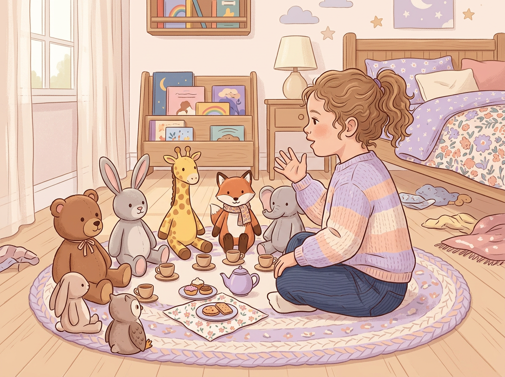

# Chapter 2: Decoding Playtime — What Your Child's Play Is Telling You

---

Let's get one thing straight before we go any further:

**Play is not a break from learning. Play *is* learning.**

When your child builds a tower out of couch cushions, she's experimenting with physics. When your son spends an hour acting out a battle between action figures, he's working on narrative structure, emotional processing, and social reasoning at the same time.

We tend to think of play as the thing kids do *between* the important stuff. Between school and homework. Between dinner and bath. But decades of child development research tell us the opposite.

Dr. Stuart Brown, founder of the National Institute for Play, spent over forty years studying play behavior in children and adults. His conclusion?

> *"Play is the single most significant factor in determining whether or not a child will grow into a well-functioning adult."*

That's not a soft, feel-good claim. Brain imaging studies, longitudinal research, and cross-cultural observation all point the same direction. Play literally shapes how the brain develops.

So when your kid is "just playing," they're actually giving you a front-row seat to how their mind works. The question is: do you know what you're watching?

This chapter will teach you how to read play like a language.

---

## The 5 Play Patterns — Your Child's Natural Operating System

Not all play looks the same, and that's the point. The *type* of play your child gravitates toward, especially during free, unstructured time, reveals something about how they process the world.

Think of these five patterns as channels. Most kids tune into all of them at some point, but they tend to have one or two default channels they return to again and again. That default is the signal.

---

### Pattern 1: Construction Play

**What it looks like:** Building with blocks, Legos, magnetic tiles, cardboard boxes, blanket forts, sand structures. Anything where the child is *making something* from raw materials.

**What it signals:** Strong spatial reasoning, planning ability, and a preference for seeing ideas take physical form. These kids often think in shapes and structures before they think in words.

**Watch for:** Does your child get frustrated when the structure falls? That frustration isn't a bad sign — it often signals a high internal standard and a drive toward problem-solving.

> **Real Parent, Real Story — Marcus & Lily, age 4**
>
> Marcus noticed that his daughter Lily wasn't interested in the coloring books other kids loved at preschool. But every evening, she'd empty the recycling bin and spend forty-five minutes building "houses" out of cereal boxes, tape, and rubber bands. He almost stopped her once — it was messy, and frankly, he needed that tape. But he bit his tongue and watched. By the following month, her structures had doors that opened, rooms inside, and furniture made from bottle caps. Lily wasn't avoiding art. She was doing architecture.

---

### Pattern 2: Imaginative Play

**What it looks like:** Pretend games, storytelling, role-playing, talking to stuffed animals, inventing characters, acting out scenes. The child creates entire worlds that don't exist — and lives in them.

**What it signals:** Narrative intelligence, emotional depth, empathy, and strong language development. These kids are processing complex social and emotional concepts through made-up scenarios.

**Watch for:** The level of detail in the pretend world. A child who names every character, assigns them relationships, and remembers the storyline from yesterday's session is showing you advanced memory and sequencing skills.

[//]: # (IMAGE_PROMPT_START)
[//]: # (NANO_BANANA_2: "A warm, editorial-style illustration of a young child sitting cross-legged on a bedroom floor, surrounded by stuffed animals arranged in a circle as if having a tea party. The child is slightly turned away from the viewer, gesturing as if telling a story. Soft natural light, pastel tones with lavender, soft peach, and cream. Cozy domestic setting, flat vector illustration style, premium quality, no text.")
[//]: # (IMAGE_PROMPT_END)

---

### Pattern 3: Physical Play

**What it looks like:** Running, climbing, jumping, dancing, wrestling, throwing, catching, balancing. The child's body is the main tool, and movement is the primary activity.

**What it signals:** Kinesthetic intelligence, a natural connection between body and brain. These kids learn by doing, not by sitting. They often pick up concepts faster when they can physically experience them.

**Watch for:** Coordination and rhythm. A child who naturally moves to music, balances on narrow surfaces for fun, or figures out how to climb something no one taught them to climb is showing you a body that's wired to learn through motion.

> *"Some children think with their hands. Others think with their feet. Either way, movement is the first language of learning."*
> — Carla Hannaford, neurophysiologist and author of *Smart Moves*

---

### Pattern 4: Investigative Play

**What it looks like:** Taking things apart, asking "why" and "how" constantly, mixing substances in the kitchen, digging in the dirt to see what's underneath, pouring water between containers, examining bugs with intense focus.

**What it signals:** Logical-scientific thinking, curiosity-driven learning, and a natural orientation toward cause and effect. These children are running experiments — they just don't call them that.

**Watch for:** The question patterns. A child who asks "What happens if...?" is thinking like a scientist. A child who takes apart a toy isn't being destructive — they're reverse-engineering.

> **Real Parent, Real Story — Priya & Arun, age 6**
>
> Priya was tired of replacing batteries. Her son Arun had taken apart every battery-operated toy in the house by age five. Remote-control cars, a musical keyboard, a talking globe — all disassembled on the kitchen table. She was about to ban him from touching anything with a battery compartment when a friend suggested she try giving him things that were *meant* to be taken apart. Old clocks from a thrift store. A broken radio. A cheap flashlight. Arun didn't just take them apart — he started drawing diagrams of how the pieces connected. He was six years old, mapping circuits with crayons. He didn't need fewer things to break. He needed more things to explore.

---

### Pattern 5: Social Play

**What it looks like:** Organizing games with other children, negotiating rules, leading group activities, mediating conflicts, seeking out interaction, wanting to work in pairs or teams rather than alone.

**What it signals:** Interpersonal intelligence. An instinct for reading people, managing group dynamics, and influencing social situations. These kids communicate naturally and often lead without trying.

**Watch for:** The role your child takes in a group. Are they the one who decides what game to play? The one who makes sure everyone gets a turn? The one who notices when someone is left out? Each of these roles tells you something different about their social wiring.

---

## How to Spot a Pattern vs. a Passing Phase

This is the question every parent asks: *"But what if they're into it this week and over it next week?"*

Fair. Kids are built to explore widely, especially in the early years. A passing interest in dinosaurs isn't the same as a deep, persistent pattern. So how do you tell the difference?

**Three markers of a real pattern:**

1. **Duration.** Does the behavior show up repeatedly over weeks or months — not just days?
2. **Depth.** Does the child go deeper over time? A passing interest stays surface-level. A real pattern shows increasing complexity, focus, or skill.
3. **Return rate.** When given a totally free choice, does the child keep coming back to this activity — even after being away from it?

If you see all three, you're looking at something worth paying attention to. If it's just one, keep watching. That's what your Observer Notes are for.

> | Passing Phase | Emerging Pattern |
> |---|---|
> | Interested for a few days, then moves on | Returns to it again and again over weeks |
> | Stays at the same level of engagement | Gets deeper, more detailed, more complex |
> | Easily redirected to something else | Resists being pulled away |
> | Triggered by external influence (a TV show, a friend) | Shows up independently, from within |

---

## What If My Child Doesn't Seem to Fit One Pattern?

Good. That's actually the most common situation.

Most children show a *blend* of two or three play patterns, and the mix changes as they grow. A child who's heavy on construction play and investigative play might be showing you a future engineer — or a future chef — or a future surgeon. The activity doesn't matter as much as the underlying thinking style.

Don't try to label your child yet. We're still in the observation phase. Your only job right now is to notice which channels they tune into most often and write it down.

In Chapter 3, we'll map these play patterns onto a more complete framework — the 8 Types of Intelligence — so you can start connecting the dots between *what they do* and *how they think.*

[//]: # (IMAGE_PROMPT_START)
[//]: # (NANO_BANANA_2: "A premium, flat vector editorial illustration showing five small vignettes arranged in a gentle arc: a child building with blocks, a child with arms outstretched pretending to fly, a child jumping mid-air, a child examining a magnifying glass over a leaf, and two children talking with animated gestures. Each figure is slightly stylized with faces turned away. Soft pastel background with muted teal, warm peach, soft gold, and cream. Clean white space between each scene, no text, high quality.")
[//]: # (IMAGE_PROMPT_END)

---

## Try This Tonight

> **Try This Tonight — The Play Pattern Spotter**
>
> 1. Give your child **30 minutes of totally unstructured time.** No screens, no instructions, no planned activity. Just an open room and whatever toys or materials are already available.
> 2. **Sit nearby and watch** (you know the drill by now). Don't direct. Don't suggest.
> 3. **Note which of the five patterns shows up** most strongly. Don't worry if you see more than one — that's normal and good.
> 4. **Write it in your Observer Notes** using this format:
>    - *Date:*
>    - *Play pattern(s) I noticed:*
>    - *What specifically happened:*
>    - *How long did they stay engaged:*
> 5. Repeat at least **three times this week,** at different times of day if possible. Morning play and after-school play can look very different.

---

## What to Say / What Not to Say During Play Observation

> | Instead of... | Try... |
> |---|---|
> | "That's a nice tower! Can you make it taller?" | *Say nothing. See if they choose to build taller on their own.* |
> | "Why don't you play with your brother?" | *Note: Does my child prefer solo or group play right now?* |
> | "You've been doing that forever, try something new." | *Ask yourself: Why does this activity hold their attention? That's data.* |
> | "Be careful!" (when they're climbing) | *Watch their body. Are they actually in danger, or are they testing their limits?* |

---

## Chapter 2 Quick Resources

- **Book:** *Play: How It Shapes the Brain, Opens the Imagination, and Invigorates the Soul* by Dr. Stuart Brown. The best book on why play matters far more than most adults realize.
- **Free printable:** Download the Playtime Observation Worksheet from the Appendix at the end of this book. It gives you a structured template for tracking play patterns over two weeks.
- **Quick read:** The American Academy of Pediatrics published a 2018 clinical report called *"The Power of Play"* — it's free online and gives you solid, research-backed confidence that protecting your child's playtime is one of the best things you can do.

---

*Next up: Chapter 3 — The 8 Types of Intelligence, translated into plain language so you can match what you've been observing to a clear framework. This is where the dots start connecting.*
