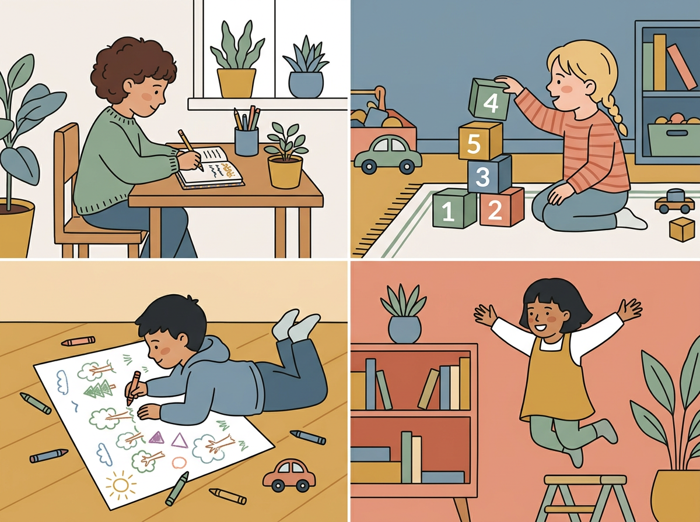
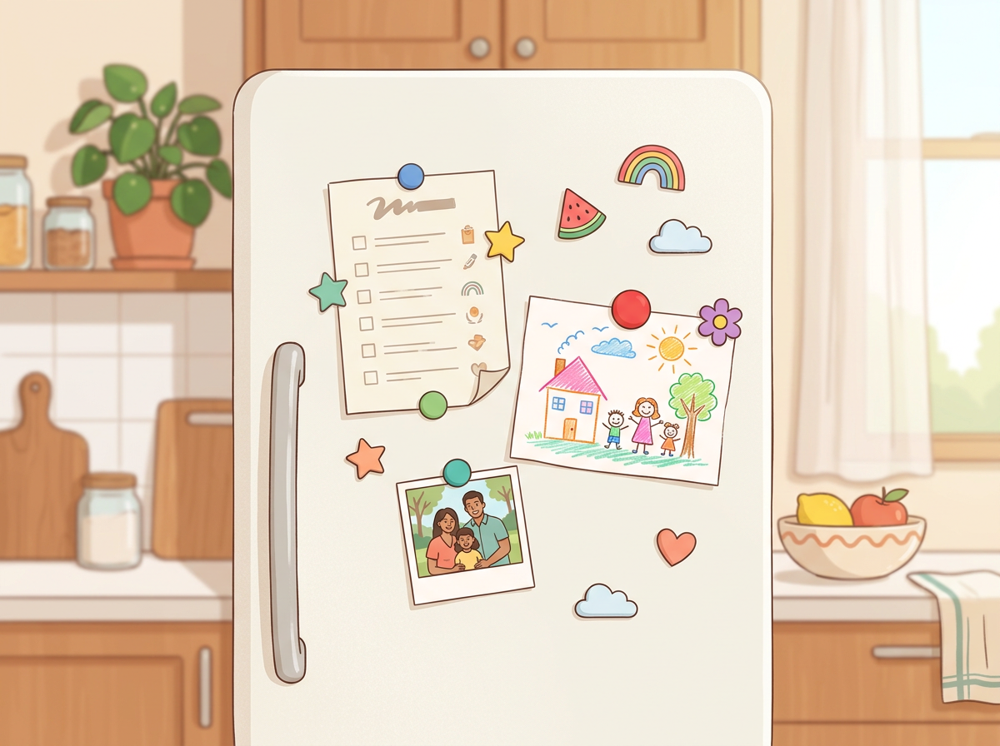

# Chapter 3: The 8 Types of Intelligence — A Parent's Field Guide

---

Here's a sentence that might change how you see your child:

**There is no such thing as a "smart kid" and a "not-smart kid." There are only different *kinds* of smart.**

Most of us grew up in a system that measured intelligence one way: tests. You sat in a chair, answered questions on paper, and got a number. That number told you — and everyone around you — where you ranked. If you were good at reading and math, you were "smart." If you weren't, well... you were something else.

That system got it wrong. Not a little wrong. The whole model was broken.

In 1983, a Harvard psychologist named Howard Gardner published a book called *Frames of Mind* that reframed the whole conversation. His argument: **human intelligence isn't a single thing you have more or less of. It's a collection of at least eight distinct abilities, and every person has a unique combination.**

Your child isn't either smart or not smart. Your child is smart in a specific *way* — and your job is to figure out which way that is.

> *"We are not all the same; we do not all have the same kinds of minds; and education works most effectively if these differences are taken into account rather than denied or ignored."*
> — Howard Gardner

This chapter translates Gardner's framework out of academic language and into something you can actually use — at the breakfast table, in the backyard, and during your 10-Minute Watch.

---

## The 8 Intelligences, in Plain Language

Below is each intelligence type with its everyday name, what it looks like in a real child, and the signals you can spot right now. You don't need to memorize all eight. Just read through them and notice which ones make you think, *"Wait — that sounds like my kid."*

---

### 1. Word Smart (Linguistic Intelligence)

**The core ability:** Thinking in words. A natural feel for language — reading, writing, storytelling, wordplay, persuasion.

**What it looks like in a child:**
- Talks early, talks often, talks to everyone (including imaginary friends)
- Loves being read to and starts "reading" books back to you (even before they can actually read)
- Makes up stories, songs, or jokes constantly
- Remembers things they've heard with surprising accuracy
- Uses words that seem advanced for their age — not because someone taught them, but because they absorbed them

**The play pattern connection:** Heavily tied to **Imaginative Play** — these kids live inside stories.

> **Real Parent, Real Story — Jenna & Cora, age 3**
>
> Jenna's daughter Cora wouldn't stop talking. At three, she was narrating her own life like a nature documentary. "Now Cora is going down the stairs. She is holding the railing because safety is very important." Jenna thought it was cute but wondered if something was off — no other kid at daycare did this. Nothing was off. Cora was processing her entire world through language. By five, she was dictating stories to her mom every night before bed — full plots, named characters, beginning-middle-end structure. She wasn't being strange. She was being Word Smart.

---

### 2. Number Smart (Logical-Mathematical Intelligence)

**The core ability:** Thinking in patterns, sequences, and cause-and-effect relationships. A natural comfort with numbers, logic, and systems.

**What it looks like in a child:**
- Sorts, categorizes, and organizes things without being asked
- Asks "why" questions that are about *how things work*, not just curiosity
- Enjoys puzzles, mazes, and strategy games
- Notices patterns in everyday life ("Mom, we always turn left after the big tree")
- Counts things for fun — steps, cars, grapes on a plate

**The play pattern connection:** Strongly linked to **Investigative Play** and **Construction Play.**

---

### 3. Picture Smart (Spatial Intelligence)

**The core ability:** Thinking in images, shapes, and space. A natural sense of how things look, fit together, and relate visually.

**What it looks like in a child:**
- Draws detailed pictures — often with perspective or proportion that surprises you
- Builds complex structures with blocks, Legos, or random household objects
- Remembers routes and locations ("This isn't the way we went last time")
- Prefers visual instructions over verbal ones
- Loves maps, diagrams, and "how it's made" videos

**The play pattern connection:** Strong overlap with **Construction Play.**

> *"The child who constantly draws isn't avoiding 'real' work. Drawing is their real work — it's how they think."*

---

### 4. Body Smart (Kinesthetic Intelligence)

**The core ability:** Thinking through physical movement and touch. The body and the brain work as one system.

**What it looks like in a child:**
- Learns better when moving — walks around while thinking, fidgets during stories, acts things out
- Picks up physical skills quickly (riding a bike, catching a ball, dancing)
- Has strong fine motor skills (cutting, threading, building small things) or gross motor skills (climbing, running, balancing) — or both
- Touches everything — needs to handle objects to understand them
- Often described as "can't sit still," which is usually misread as a problem

**The play pattern connection:** Directly maps to **Physical Play.**

> **Real Parent, Real Story — Tom & Isaiah, age 7**
>
> Tom's son Isaiah was getting low marks for "classroom behavior" because he couldn't sit still during reading time. He'd rock in his chair, tap his feet, and twist his pencil between his fingers. Tom was worried. Then his wife suggested they try an experiment: let Isaiah listen to his reading assignment while walking laps around the backyard. Isaiah retained more of the story that evening than he ever had sitting at his desk. His body wasn't the problem. His body was the solution — the thing his brain needed to be active in order to process information. Once Tom understood that, he stopped fighting the movement and started working with it.

[//]: # (IMAGE_PROMPT_START)
[//]: # (NANO_BANANA_2: "A warm, editorial flat vector illustration showing four small scenes in a 2x2 grid: top-left a child writing in a journal, top-right a child stacking numbered blocks, bottom-left a child drawing on a large piece of paper on the floor, bottom-right a child mid-jump with arms spread wide. Each child is slightly stylized with face turned to the side. Soft pastel tones — warm gold, sage green, dusty blue, muted coral. Clean white background separating each scene, no text, premium editorial quality.")
[//]: # (IMAGE_PROMPT_END)

---

### 5. Music Smart (Musical Intelligence)

**The core ability:** Thinking in rhythms, melodies, and tonal patterns. A natural sensitivity to sound — not just music, but all auditory information.

**What it looks like in a child:**
- Hums, sings, or taps rhythms constantly — often without realizing it
- Remembers songs after hearing them once or twice
- Notices sounds others miss (a bird outside, a rhythm in a washing machine)
- Responds emotionally to music — gets excited, calm, or moved
- Makes up their own songs or changes the words to existing ones

**The play pattern connection:** Can show up across multiple play types, but often paired with **Imaginative Play** (making up songs for characters) or **Physical Play** (dancing, rhythmic movement).

---

### 6. People Smart (Interpersonal Intelligence)

**The core ability:** Thinking through social connection. A natural ability to read other people — their moods, motivations, and needs.

**What it looks like in a child:**
- Makes friends easily and across age groups
- Notices when someone is upset before anyone else does
- Prefers group activities over solo ones
- Naturally takes on a leadership or peacemaker role
- Adjusts their behavior based on who they're with (not in a manipulative way — in a socially aware way)

**The play pattern connection:** Directly maps to **Social Play.**

---

### 7. Self Smart (Intrapersonal Intelligence)

**The core ability:** Thinking through self-reflection. A natural understanding of their own emotions, strengths, and inner world.

**What it looks like in a child:**
- Comfortable playing alone — and *prefers* it sometimes
- Expresses emotions clearly: "I'm frustrated because..."
- Has strong opinions about what they like and don't like
- Needs time to process before responding (the "quiet thinker")
- Shows unusual self-awareness for their age

**Watch for:** This intelligence gets overlooked the most, because our culture tends to reward outgoing, social behavior. **A child who prefers solitude is not shy or antisocial. They may be deeply Self Smart.** Protect their alone time. It's where their best thinking happens.

> *"The child who sits quietly in the corner isn't missing out. They're going somewhere you can't see."*

---

### 8. Nature Smart (Naturalist Intelligence)

**The core ability:** Thinking through the natural world. A drive to observe, classify, and connect with living things and outdoor environments.

**What it looks like in a child:**
- Fascinated by animals, insects, plants, weather, rocks, water
- Sorts and classifies natural objects (arranging shells by size, organizing leaves by shape)
- Wants to be outside constantly — and is more focused and calm when they are
- Notices environmental details ("That cloud looks different from yesterday")
- Feels genuine distress about animals being hurt or nature being damaged

**The play pattern connection:** Can overlap with **Investigative Play** (examining nature) and **Construction Play** (building with natural materials).

> **Real Parent, Real Story — David & Suki, age 5**
>
> David's daughter Suki refused to walk past any bush without stopping. Every walk to school took twice as long because she had to inspect every ant trail, fallen leaf, and puddle. David was exasperated — they were late every morning. Then he decided to try something different. He woke Suki up fifteen minutes earlier and told her the extra time was "her nature walk." She could stop and look at anything she wanted. Suki was calmer at school. She started bringing home leaves and pressing them into a notebook, drawing them from memory. She wasn't being slow. She was doing exactly what her brain needed to do — observe the living world around her.

---

## Why Your Child Probably Has 2–3 Dominant Types (And That's Perfect)

Don't try to squeeze your child into one box. Gardner's framework isn't a personality test with a single result. It's more like a mixing board — every child has all eight channels available, but two or three tend to be turned up louder than the rest.

A child who is strong in **Body Smart + People Smart** might thrive in team sports.
A child who leads with **Word Smart + Self Smart** might become a reflective writer.
A child high in **Number Smart + Nature Smart** might end up fascinated by environmental science.

**The combinations are what make your child unique.** You're not trying to decide which single intelligence they "are." You're noticing which ones light up most often, and then making space for those strengths to grow.

---

## The Intelligence Spotter Checklist

Use this quick reference to start mapping what you see during your Observer sessions. For each type, rate how often you see these behaviors: **Rarely / Sometimes / Often.**

| Intelligence Type | Key Behavior to Watch For | Rarely | Sometimes | Often |
|---|---|---|---|---|
| Word Smart | Tells stories, loves wordplay, talks through problems | ☐ | ☐ | ☐ |
| Number Smart | Sorts things, notices patterns, asks "how" questions | ☐ | ☐ | ☐ |
| Picture Smart | Draws in detail, builds complex structures, thinks visually | ☐ | ☐ | ☐ |
| Body Smart | Learns through movement, strong coordination, can't sit still | ☐ | ☐ | ☐ |
| Music Smart | Hums, taps rhythms, remembers songs, responds to sound | ☐ | ☐ | ☐ |
| People Smart | Reads social cues, leads or mediates, makes friends easily | ☐ | ☐ | ☐ |
| Self Smart | Prefers solo time, emotionally articulate, strong self-awareness | ☐ | ☐ | ☐ |
| Nature Smart | Drawn to outdoors, classifies natural objects, observes animals | ☐ | ☐ | ☐ |

**Print this out. Stick it on your fridge next to your Observer Notes.** After two weeks of watching, fill it in. The pattern will jump off the page.

[//]: # (IMAGE_PROMPT_START)
[//]: # (NANO_BANANA_2: "A clean, premium editorial flat vector illustration of a refrigerator door with colorful magnets holding up a checklist on white paper, a child's crayon drawing, and a small photo. Soft natural light from the side, warm domestic kitchen setting slightly blurred in background. Pastel tones — soft white, warm butter yellow, muted teal, light coral. No text visible on the papers, stylized and minimal, high quality.")
[//]: # (IMAGE_PROMPT_END)

---

## Try This Tonight

> **Try This Tonight — The Dinner Table Intelligence Game**
>
> At dinner tonight, ask your child these five questions. Don't make it feel like a quiz — keep it light and curious. Their answers (and the *way* they answer) will give you clues.
>
> 1. "If you could do anything tomorrow — no school, no rules — what would you do all day?"
> 2. "What's the most interesting thing you noticed today?"
> 3. "If you had to teach someone one thing you're really good at, what would it be?"
> 4. "Would you rather play alone or with friends? Why?"
> 5. "If I gave you a big empty box, what would you do with it?"
>
> Don't correct, guide, or judge the answers. Just listen. Write them down after dinner. You'll be surprised what shows up.

---

## Chapter 3 Quick Resources

- **Book:** *Frames of Mind: The Theory of Multiple Intelligences* by Howard Gardner — the original source. Dense in places but worth reading the introduction and the chapter on whichever intelligence type matches your child.
- **For a lighter read:** *7 Kinds of Smart* by Thomas Armstrong — a more accessible, parent-friendly take on Gardner's framework with practical activity ideas for each type.
- **Free online tool:** Search for "multiple intelligences quiz for kids" — several reputable education sites offer free, age-appropriate versions. Use them as conversation starters, not labels.

---

*This wraps up Part 1: The Talent Discovery Framework. You now have three tools in your pocket — the Observer Method, the 5 Play Patterns, and the 8 Intelligences. In Part 2, we'll get specific. Chapter 4 starts with your youngest: ages 0–3, and exactly what to look for during those fast-moving early years.*
