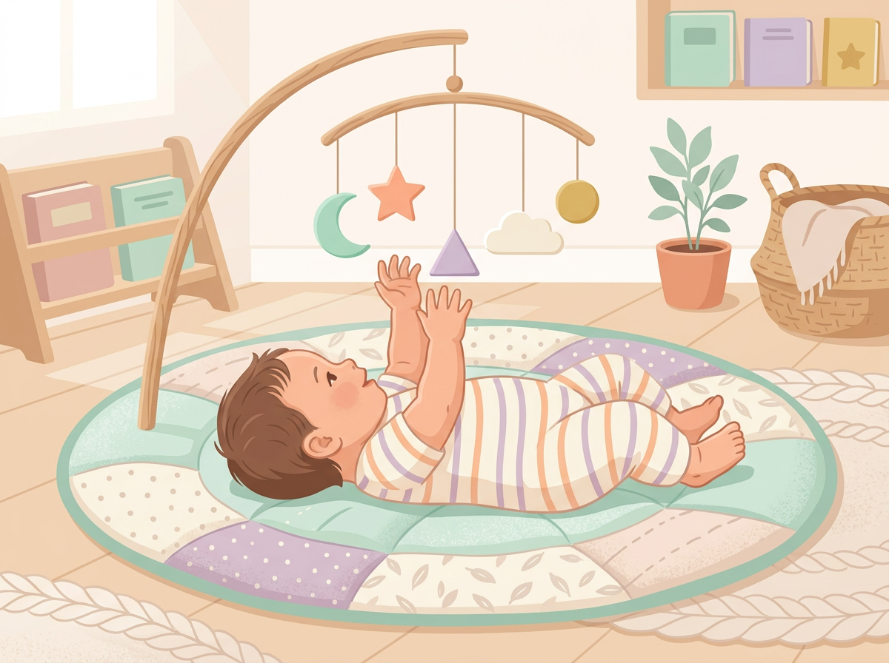
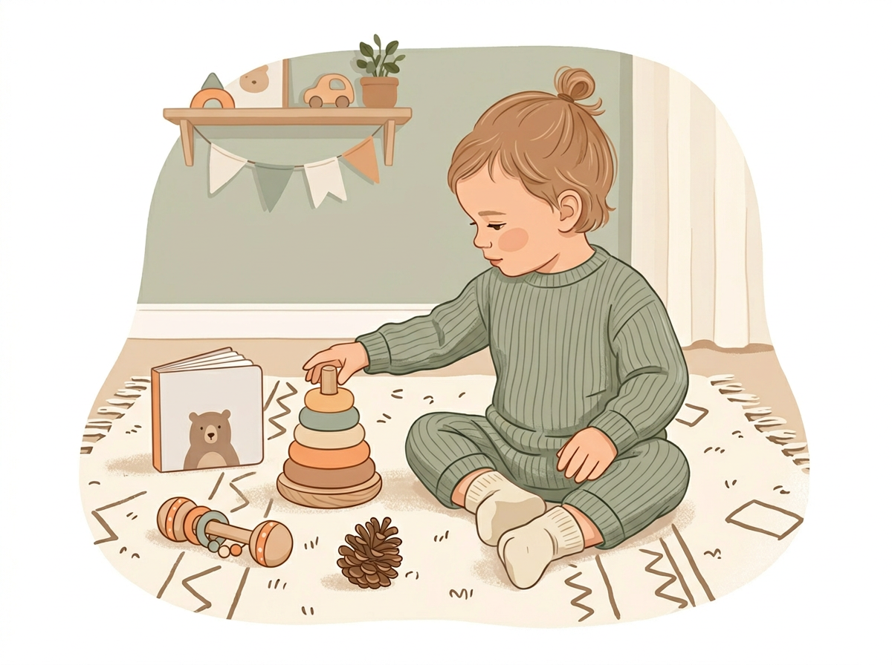

# Chapter 4: Ages 0–3 — The Foundation Years

---

## Part 2: Age-Specific Identification Guides

---

If you're the parent of a baby or toddler, you might be thinking: *"Isn't it too early to spot talents? They can barely hold a spoon."*

It's a fair question. And the answer is: **no, it's not too early — but you need to know what you're looking for.**

Between birth and age three, your child's brain is building connections faster than it ever will again. By age two, a toddler's brain has roughly **100 trillion neural connections**, about twice as many as an adult's. Their brain is not a blank slate. It's a construction zone running at full speed.

You're not looking for a child who can read at eighteen months or do math at two. That's not what early talent looks like. What you *are* looking for are **preferences, patterns, and intensity**: the quiet signals that tell you how your child's brain prefers to take in the world.

Dr. Andrew Meltzoff, co-director of the Institute for Learning & Brain Sciences at the University of Washington, has spent decades studying infant cognition. His research shows that babies as young as a few weeks old demonstrate measurable preferences for certain types of stimulation — and those preferences tend to remain stable as they grow.

> *"Infants are not passive receivers of information. They are active participants in figuring out the world — and they each do it a little differently."*
> — Dr. Andrew Meltzoff

In other words: your baby already has a style. This chapter will help you see it.

---

## Milestones vs. Signals: Knowing the Difference

Every pediatrician's office has a milestone chart on the wall. Rolls over by four months. First words by twelve months. Walks by fourteen months. These milestones are useful — they tell you your child is developing on track.

But milestones don't tell you about talent. They tell you about averages.

**A signal is different from a milestone.** A milestone says your child *can* do something. A signal tells you what your child *chooses* to do — repeatedly, intensely, and with focus that stands out from the baseline.

Here's how to tell them apart:

> | Milestone | Signal |
> |---|---|
> | Baby babbles by 6 months | Baby babbles *constantly* and in varied tones, as if practicing conversation |
> | Toddler stacks 2–3 blocks by 18 months | Toddler stacks blocks for 20 minutes straight, gets frustrated when they fall, tries again |
> | Child says 50+ words by age 2 | Child uses words in unusual combinations, makes up words, or narrates their actions |
> | Child walks independently by 14 months | Child doesn't just walk — they climb, balance, test every surface they can stand on |

A milestone is the minimum. A signal is the *way* your child does it — the enthusiasm, the repetition, the intensity.

**You're not comparing your child to other children. You're comparing your child to their own baseline.** What lights them up more than everything else?

---

## Reading the Senses: What Early Preferences Reveal

Before a child can talk, play, or choose activities, they experience the world through their senses. And they don't experience all senses equally — most babies show a noticeable lean toward one or two sensory channels.

### The Visual Baby

- Tracks moving objects with intense focus
- Stares at patterns, colors, or contrasts for long stretches
- Gets excited or calm when shown specific visual stimulation (lights, faces, picture books)
- May prefer looking over touching

**What this might signal:** Early spatial intelligence. These babies often grow into kids who are Picture Smart — drawn to drawing, building, and visual thinking.

### The Auditory Baby

- Turns toward sounds quickly and consistently
- Calms down or lights up in response to music, singing, or rhythmic speech
- Babbles with varied pitch and rhythm — it sounds almost musical
- Startled or distressed by sudden loud noises more than other babies

**What this might signal:** Musical intelligence or linguistic intelligence. These babies are processing the *sound* of the world before anything else.

### The Tactile Baby

- Needs to touch everything — different textures, temperatures, surfaces
- Calms down when held, swaddled, or given something to grip
- Explores objects by mouthing, squeezing, and handling before looking at them
- Responds strongly to changes in physical environment (clothing, blankets, bath water)

**What this might signal:** Kinesthetic intelligence. These babies are learning through their body first — the foundation of Body Smart thinking.

### The Movement Baby

- Kicks, squirms, and rolls constantly — more than seems typical
- Reaches motor milestones on the early side (rolling, crawling, pulling up)
- Happiest when being carried, bounced, or swung
- Frustrated by confinement (car seats, high chairs, strollers)

**What this might signal:** Also kinesthetic intelligence, but with a stronger gross-motor emphasis. These are the future climbers, dancers, and athletes.

[//]: # (IMAGE_PROMPT_START)
[//]: # (NANO_BANANA_2: "A gentle, warm editorial flat vector illustration of a baby lying on a soft play mat, reaching up toward a colorful hanging mobile with simple geometric shapes. The baby is viewed from a slight angle, face partly turned away. Soft diffused light, pastel nursery tones — soft mint, warm peach, creamy white, light lavender. Minimal cozy domestic setting, premium quality, no text.")
[//]: # (IMAGE_PROMPT_END)

---

## Early Language Patterns: The Chatterbox, The Pointer, and The Singer

Between twelve and thirty-six months, language starts to bloom — but it doesn't bloom the same way in every child. Pay attention to *how* your toddler communicates, not just *when.*

**The Chatterbox** talks early, talks often, and seems to absorb new words like a sponge. They try to have conversations even when they don't have the vocabulary yet. They fill gaps with made-up words or long, confident strings of babble that have the rhythm of real sentences.

*Signal:* Strong linguistic intelligence. This child processes the world through words.

**The Pointer** communicates through gesture, expression, and action long before they rely on words. They show you what they want. They lead you by the hand. They point at things and look at your face to check your reaction.

*Signal:* This doesn't mean they're "behind" in language. Pointers are often strong in interpersonal intelligence — they're reading *you* as their primary source of information. They may also be developing spatial or kinesthetic intelligence, using their body as their first language.

**The Singer** doesn't talk as much as they hum, chant, and vocalize. They turn words into melodies. They repeat the musical parts of songs before the lyrical parts. Rhythm comes before grammar.

*Signal:* Musical intelligence showing up early. These children hear the world in tones and patterns before they organize it into sentences.

> **Real Parent, Real Story — Keiko & Milo, age 2**
>
> Keiko's son Milo didn't say his first clear word until he was almost two — later than most of his playgroup. She was concerned. But Milo had been humming recognizable melodies since he was fourteen months old. He could hum "Twinkle, Twinkle, Little Star" from start to finish before he could say "mama" consistently. When Keiko mentioned this to her pediatrician, the doctor smiled and said, "His brain is prioritizing sound patterns right now. The words will come." They did — and when they came, Milo spoke in full sentences almost immediately, as if he'd been assembling them quietly in the background while his musical brain ran the show.

---

## Movement and Coordination: Reading the Physical Signals

Some toddlers are content to sit and explore with their hands. Others are in constant motion from the moment they can roll over. Neither is better or worse — but the difference matters.

**Early physical signals to watch for:**

- **The Climber:** This child scales furniture, playground equipment, and anything else before you think they're ready. They have an internal sense of balance that develops ahead of schedule. (*Signal:* Kinesthetic intelligence, gross motor emphasis.)

- **The Fine Motor Kid:** This child is drawn to small objects, pinching, threading, stacking with precision. They might spend ten minutes trying to fit a lid on a container — not out of frustration, but out of determination. (*Signal:* Kinesthetic intelligence, fine motor emphasis — also overlaps with spatial intelligence.)

- **The Dancer:** This child moves to music instinctively. Not just bobbing — actually coordinating arms, legs, and rhythm in a way that looks almost choreographed. (*Signal:* Musical + kinesthetic intelligence working together.)

---

## Try This Tonight

> **Try This Tonight — The Baby & Toddler Preference Scan**
>
> Pick one evening this week and try this simple exercise:
>
> 1. **Set out 4–5 different objects** on the floor in front of your child: a picture book, a musical toy or shaker, a textured ball, a set of stacking cups, and something from nature (a pinecone, a large leaf, a smooth stone).
> 2. **Sit back and watch.** Don't point to anything. Don't say "Try this one!" Just observe.
> 3. **Note the order** in which they reach for things. What do they pick up first? What do they spend the most time with? What do they ignore?
> 4. **Note *how* they explore each object.** Do they look at it (visual)? Shake it and listen (auditory)? Squeeze and mouth it (tactile)? Try to stack or combine them (spatial)?
> 5. **Write it down.** Three sentences is enough.
>
> Repeat this once a week with slightly different objects. Over a month, you'll start to see a clear preference emerging.

---

## A Note for Parents Who Are Worried

If you've read this chapter and your brain is whispering, *"But my child isn't doing any of these things,"* — take a breath.

Every child develops on their own timeline. The ranges in this chapter are wide on purpose. A baby who isn't babbling musically at fourteen months isn't "missing" musical intelligence — they might simply be on a different timetable, or their primary channel might be visual or physical instead.

**This book is not a diagnostic tool.** It's a noticing tool. You're here to watch, wonder, and appreciate — not to measure your child against a checklist and panic.

The best thing you can do for a child between zero and three is what you're already doing: being present, being warm, and paying attention. This chapter just helps you pay attention a little more specifically.

---

## Chapter 4 Quick Resources

- **Book:** *The Scientist in the Crib* by Alison Gopnik, Andrew Meltzoff, and Patricia Kuhl — already recommended in Chapter 1, and essential reading for the 0–3 stage. Warm, accessible, and eye-opening.
- **Book:** *Brain Rules for Baby* by John Medina — a brain scientist's practical guide to the first five years, written in a funny, no-nonsense style.
- **Free tool:** Start a simple log in your phone's Notes app called "Baby Watch." Use the format: Date + What they reached for + How long + How they explored it. That's your Baby & Toddler Talent Tracker.

---

*Next up: Chapter 5 takes us into ages 4–6, where everything speeds up. Your child starts making choices, showing preferences loudly, and revealing strengths that are impossible to miss — if you know where to look.*

[//]: # (IMAGE_PROMPT_START)
[//]: # (NANO_BANANA_2: "A warm, cozy editorial flat vector illustration of a toddler sitting on a soft rug surrounded by simple objects — a wooden stacking ring, a picture book, a small shaker instrument, and a pinecone. The toddler is reaching toward one of the objects, face turned slightly away from the viewer. Soft warm light, gentle nursery setting, pastel tones — cream, soft apricot, muted sage, warm beige. Clean white background edges, no text, premium quality.")
[//]: # (IMAGE_PROMPT_END)

