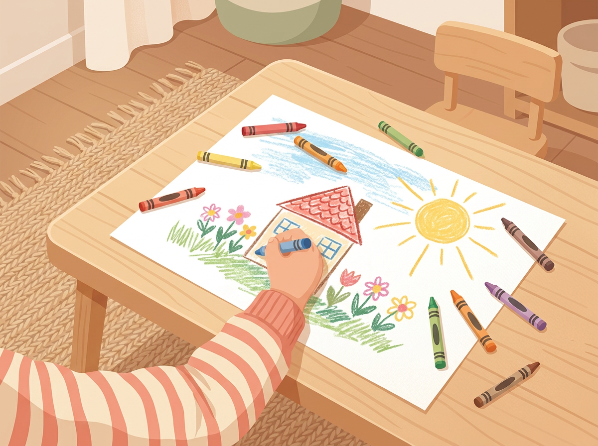

# Chapter 5: Ages 4–6 — The Exploration Explosion

---

If the 0–3 years were about building the foundation, ages four through six are when the house starts to take shape — and you can finally see the floor plan.

This is the age when your child stops just *reacting* to the world and starts *choosing* how to engage with it. They pick their own games. They decide who to play with. They develop strong opinions about what they like and don't like. And if you've been using your Observer Notes, you'll start to notice something exciting: **the signals are getting louder.**

A child who was a Chatterbox at two is now telling elaborate stories to anyone who'll listen. A toddler who loved stacking blocks is now constructing entire cities on the living room floor. The Movement Baby? They're climbing trees and doing things on the monkey bars that make your stomach drop.

**Ages 4–6 are the golden window for talent signals.** Not because this is the only time they appear, but because this is when natural preferences and social behavior start working together in ways that are visible, consistent, and hard to miss.

Let's break down exactly what to look for.

---

## Social Behavior Clues: Who Is Your Child in a Group?

Between four and six, children begin to develop distinct social identities. They're no longer just playing *near* other kids — they're playing *with* them. And the role they naturally take tells you something important.

**The Leader:** This child decides what the game is, assigns roles, and sets the rules. They don't wait for permission to organize — they just do it. Other kids tend to follow them, not because they're bossy, but because they project confidence and clarity.

*Signal:* Strong interpersonal intelligence. Also watch for early signs of logical thinking — leaders often have an instinct for systems and structure.

**The Peacemaker:** This child notices when someone is upset or left out. They mediate arguments, share toys voluntarily, and adjust their own behavior to keep the group happy. They often sacrifice their own preference to maintain harmony.

*Signal:* Deep interpersonal + intrapersonal intelligence. These children are reading emotional data that many adults miss.

**The Lone Explorer:** This child is perfectly happy playing alone, even when other kids are available. They're not anxious or excluded — they simply prefer their own company and their own projects. They might watch the group from a distance before deciding whether to join.

*Signal:* Strong intrapersonal intelligence, often combined with spatial, naturalist, or linguistic strengths. Don't push this child to "socialize more." Their solo time is productive.

> **Real Parent, Real Story — Angela & Noah, age 5**
>
> Angela worried because her son Noah always played alone at birthday parties. While other kids ran in packs, Noah would find a corner, pull out whatever toys were nearby, and build something quietly. She mentioned it to his preschool teacher, expecting concern. Instead, the teacher said: "Noah is one of the most focused kids in the class. When he works alone, he produces things the other children can't believe. Last week he built a bridge out of paper cups that held the weight of a book. He's not lonely — he's working." Angela stopped trying to push Noah into group games. She started giving him more materials and more space. He didn't need more friends. He needed more cardboard.

---

## Creative Output: What Their Drawings, Stories, and Games Really Mean

At this age, children start producing things — drawings, stories, inventions, performances. These creations are incredibly useful for an observing parent, because they show you how the child thinks.

**What to look for in drawings:**

- **Detail and accuracy:** Does the drawing include things most kids this age wouldn't notice? Windows on a building, shadows, specific colors for specific objects? This suggests spatial intelligence and high visual attention.
- **Narrative content:** Does the drawing tell a story? "This is the house, and this is the dog running away, and this is the rain coming"? That's linguistic intelligence working through a visual medium.
- **Repetition of a theme:** Does your child draw the same subject over and over — animals, vehicles, people, buildings? Repetition signals deep interest and an emerging area of focus.

**What to look for in made-up games:**

- **Complexity of rules:** A child who invents games with detailed rules, turn-taking structures, and scoring systems is showing you logical-mathematical thinking.
- **Character depth:** A child whose pretend games have named characters with relationships, backstories, and emotional arcs is demonstrating advanced narrative intelligence.
- **Physical choreography:** A child who invents games centered on movement — obstacle courses, dance routines, acrobatic challenges — is showing kinesthetic intelligence.

> *"A child's drawing is not a picture of what they see. It's a picture of what they know."*
> — Lev Vygotsky, developmental psychologist

[//]: # (IMAGE_PROMPT_START)
[//]: # (NANO_BANANA_2: "A warm, premium editorial flat vector illustration of a child's hand drawing with crayons on a large white sheet of paper spread across a low table. The drawing shows a colorful house with a garden and a sun. Crayons scattered around. View from above at a slight angle, child's face not visible. Soft warm lighting, pastel tones — warm yellow, soft coral, muted green, light blue. Clean and minimal, no text, high quality.")
[//]: # (IMAGE_PROMPT_END)

---

## Academic Readiness vs. Natural Curiosity — Knowing the Difference

Between ages four and six, a strange pressure starts to build. Suddenly, everyone is talking about "school readiness." Can they write their name? Do they know their letters? Can they count to twenty?

These skills matter. But they can also distract you from something more important: **what your child naturally gravitates toward when no one is testing them.**

A child who can recite the alphabet because they've been drilled on it every night is showing you *compliance.* A child who picks up a book and pretends to read it — making up the story from the pictures, turning pages with real intention — is showing you *drive.*

**The difference between readiness and curiosity:**

> | Academic Readiness | Natural Curiosity |
> |---|---|
> | Can recite letters when asked | Notices letters on street signs without prompting |
> | Counts to 20 during a structured exercise | Counts the stairs every time they walk up them — for fun |
> | Draws shapes when instructed | Fills notebooks with drawings nobody asked for |
> | Sits still during circle time | Asks questions that interrupt circle time because they genuinely want to know |

Both are fine. But only one of them tells you something about your child's internal wiring.

**When you're observing a 4–6 year old, prioritize what they do when nobody is directing them.** That's where the talent signals live.

---

## The Preschooler Interest Map

Here's a simple visual tool you can make in five minutes. It will help you see your child's interest landscape at a glance.

**How to make it:**

1. Take a blank piece of paper and draw a circle in the center. Write your child's name inside it.
2. Around the circle, draw 6–8 smaller bubbles.
3. In each bubble, write one thing your child has shown consistent interest in over the past month. Not what you've enrolled them in — what they choose on their own.
4. Draw the bubbles **bigger** for stronger interests and **smaller** for lighter ones.
5. Look for clusters. Are most of the big bubbles physical? Creative? Social? Investigative?

This isn't scientific. It's a thinking tool — a way to organize what you've been noticing and see it all in one place. Hang it next to your Intelligence Spotter Checklist on the fridge. Update it monthly.

> **Real Parent, Real Story — Sam & Zara, age 6**
>
> Sam made a Preschooler Interest Map for his daughter Zara and was surprised by what he saw. He'd been signing her up for soccer and art classes — two things *he* thought were good for kids. But when he filled in the bubbles based on what Zara actually chose to do, the biggest ones were: "organizing her stuffed animals into families," "telling stories about her imaginary school," and "helping her little brother with things." The biggest bubbles were all social and narrative. Zara wasn't an athlete or a visual artist — she was People Smart and Word Smart. Sam cancelled soccer and signed her up for a children's theater group. She thrived immediately.

---

## Try This Tonight

> **Try This Tonight — The "What Would You Choose?" Experiment**
>
> 1. Set up **four simple stations** in your living room or play area:
>    - **Station A:** Paper, crayons, and stickers (creative/visual)
>    - **Station B:** Building blocks or Legos (construction/spatial)
>    - **Station C:** A few costumes or props — hats, scarves, a toy microphone (imaginative/social)
>    - **Station D:** A magnifying glass, a bowl of water, and some small objects to drop in (investigative/science)
> 2. Tell your child: **"You can play with any of these. I'll be right here."**
> 3. Don't guide them. Don't point. Just watch.
> 4. **Note:** Which station do they go to first? How long do they stay? Do they combine stations? Do they ignore any completely?
> 5. Write it in your Observer Notes.
>
> This takes ten minutes and costs nothing. Do it once a week for a month, and the pattern will be obvious.

---

## What to Say / What Not to Say at This Age

At four to six, your words land differently. Children this age are starting to build a story about who they are. The way you respond to their interests feeds that story.

> | Instead of... | Try... |
> |---|---|
> | "You're so smart!" | "You worked really hard on that. Tell me about it." |
> | "Why don't you try something else?" | "I notice you really love doing this. What do you like about it?" |
> | "That's not how you're supposed to do it." | "Interesting — you found a different way. What happens next?" |
> | "Your friend Sarah can already read." | *Never say this. Comparison kills curiosity.* |
> | "Sit still and focus." | "I can see you need to move. Let's find a way to move AND do this." |

---

## Chapter 5 Quick Resources

- **Book:** *The Whole-Brain Child* by Daniel J. Siegel and Tina Payne Bryson — practical strategies for understanding your child's developing brain at this exact age. Short chapters, real scenarios, easy to read in pieces.
- **Activity idea:** Create a "Creation Station" — a low table or corner with rotating art supplies, building materials, and open-ended toys. No instructions, no templates. Just materials and freedom. Watch what they make.
- **Free printable:** The Preschooler Interest Map template is included in the Appendix.

---

*Next up: Chapter 6 covers ages 7–10, when interests start to solidify, school gets more demanding, and your child's passions — if you've been paying attention — begin to take real shape.*
