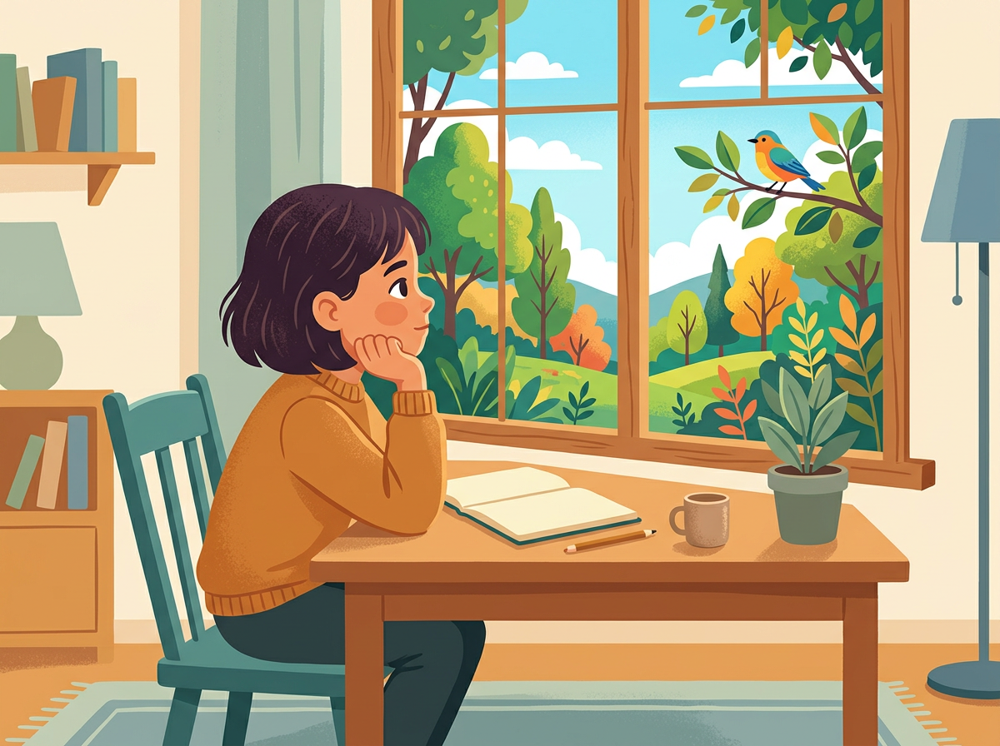
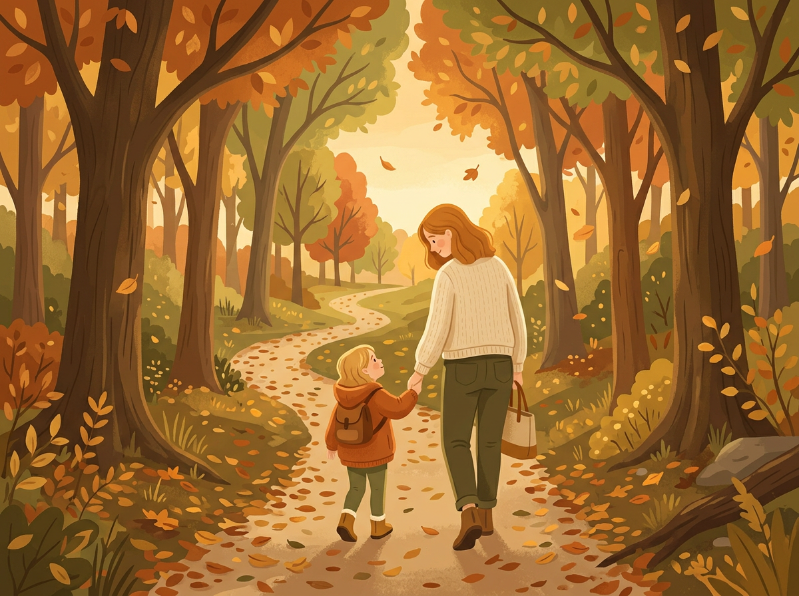

# Chapter 6: Ages 7–10 — Passion Takes Shape

---

Something shifts around age seven.

The wide-open exploration of the preschool years starts to narrow — not in a bad way, but in a meaningful one. Your child begins to *choose.* Not just what to play with for the next thirty minutes, but what they care about. What they want to get better at. What they're willing to work for.

This is the age when a passing interest becomes a real passion — or quietly fades away. And your job as an Observer Parent shifts, too. You're no longer just watching to see what lights up. You're watching to see **what stays lit.**

Between seven and ten, children develop something researchers call **"effortful engagement"**: the ability to push through difficulty because the activity itself matters to them. A five-year-old quits when something gets hard. A nine-year-old who cares about what they're doing will try again. And again. And again.

That persistence, not raw skill, is the clearest indicator of natural talent at this age.

> *"Passion is not something you find. It's something that finds you — usually when you're doing something you can't stop doing."*

---

## When Interests Start to Stick: Spotting Commitment vs. Obligation

By now, your child has probably been enrolled in a handful of activities — sports, music lessons, art classes, scouts. Some were their idea. Some were yours. And some are still running purely on momentum and the fact that the semester isn't over yet.

Here's how to tell the difference between a genuine commitment and an obligation your child is tolerating:

> | Commitment | Obligation |
> |---|---|
> | They talk about it between sessions | They only think about it when it's happening |
> | They practice or engage on their own, without being asked | They do the minimum and stop |
> | They get excited — or at least energized — when it's time to go | They stall, complain, or suddenly feel "sick" |
> | They want to learn more, go deeper, take on harder challenges | They resist increasing difficulty |
> | When they struggle, they push through or ask for help | When they struggle, they shut down or want to quit |

**Neither response makes your child good or bad.** An obligation simply means this activity doesn't match their natural wiring. And that's valuable information — it frees you to look for what does.

> **Real Parent, Real Story — Claudia & Mateo, age 8**
>
> Claudia had signed Mateo up for piano lessons because she believed every child should learn an instrument. Mateo cooperated. He practiced when told. He passed his graded pieces. But he never once sat down at the piano by choice. Not once in two years.
>
> Then one Saturday, Claudia took him to a local science fair. Mateo spent three hours there. He asked the exhibitors so many questions that two of them gave him their email addresses. On the drive home, he talked nonstop about volcanoes, circuits, and "how you could use magnets to make something float."
>
> That evening, unprompted, he started building an experiment on the kitchen counter with baking soda and vinegar. He didn't stop until bedtime.
>
> Claudia didn't cancel piano immediately — but she added a weekly trip to the library's science section and bought a basic experiments kit for twenty dollars. Within a month, she had her answer. Mateo had spent two years doing what he was told. In one afternoon, she saw what he actually wanted to do.

---

## How School Can Mask Natural Talent (And What to Do About It)

Here's something that's hard to hear: **school measures a narrow set of abilities, and your child's strongest talent might not be one of them.**

Traditional classrooms reward linguistic and logical-mathematical intelligence above everything else. If your child is Word Smart or Number Smart, school will probably reflect their strengths. They'll get good grades, positive feedback, and the sense that they're "doing well."

But if your child's dominant intelligence is kinesthetic, musical, spatial, interpersonal, or naturalist? School might actively work against them. Not on purpose — but by design.

**Signs that school might be masking your child's talent:**

- They get average or low grades but show intense skill or focus in non-academic areas
- Teachers describe them as "distracted" or "unfocused" — but at home, they concentrate for long stretches on things they choose
- They come alive during recess, art, P.E., or group projects — and shut down during desk work
- They're labeled as "not reaching their potential," which usually means "not performing in the way we measure"

**What to do about it:**

1. **Don't let report cards define your child's abilities.** A report card measures school performance, not natural intelligence.
2. **Talk to their teacher — but ask different questions.** Instead of "How are their grades?", ask: "What do they seem most excited about? When do you see them most engaged? What surprises you about them?"
3. **Protect their non-school hours.** If school isn't the place where your child's strengths shine, then after-school time, weekends, and holidays become even more important. Guard that time for exploration.
4. **Validate what they're good at — even if it's not on the curriculum.** When your child builds an incredible Lego creation or spends an hour teaching their younger sibling to ride a bike, say: "That took real skill. I see how good you are at that." They need to hear it from you, especially if they're not hearing it at school.

[//]: # (IMAGE_PROMPT_START)
[//]: # (NANO_BANANA_2: "A warm, editorial flat vector illustration of a child sitting at a desk near a window, chin in hand, gazing outside with a dreamy expression. Outside the window, a vivid, colorful nature scene — trees, a bird, a bright sky. Inside, the desk has a plain open notebook. The contrast between the muted indoor tones and the vibrant window scene is the focal point. Soft pastel palette with warm amber, muted teal, soft green, and cream. Child's face slightly turned away, stylized. No text, premium quality.")
[//]: # (IMAGE_PROMPT_END)

---

## The Role of Frustration: Why Struggling Can Be a Sign of Strength

This might sound backwards, so stay with me:

**When your child gets frustrated by something they care about, that frustration is a good sign.**

A child who doesn't care will walk away when something gets hard. A child who *does* care will get upset — and then try again. That emotional response is the engine of growth. It means the activity matters enough to fight for.

Carol Dweck's research at Stanford (which we'll dig into in Chapter 7) shows that **the willingness to struggle predicts long-term success better than early ability.** A child who is "naturally good" at something but avoids difficulty will eventually plateau. A child who struggles but persists will eventually pass them.

**What frustration looks like when it's healthy:**
- They get upset but keep going
- They ask for help but try their own solution first
- They come back to the activity after a break
- They show visible improvement over time — even if it's slow

**What frustration looks like when it's a red flag:**
- They cry or shut down every time and refuse to return
- The activity was never their choice in the first place
- The difficulty is coming from external pressure, not internal challenge
- They show signs of anxiety, not determination

Your role: **Stay close, stay quiet, and resist the urge to fix it.** Let them sit in the difficulty for a moment. If they push through it, that tells you something powerful about their connection to this activity.

---

## Peer Comparison and Self-Awareness — Helping Your Child Stay Confident

Between seven and ten, something socially painful happens: **children start comparing themselves to each other, and they start caring about the results.**

"Jake can draw better than me." "Emma is the fastest in the class." "Everyone else already knows how to do this."

These comparisons are normal, but they can be destructive if left unchecked — especially for a child whose strengths don't show up in the areas their peers value most.

**How to handle it:**

> | When your child says... | A response that helps |
> |---|---|
> | "I'm not as good as [friend]." | "Different people are good at different things. What's something *you* do that feels easy for you but hard for others?" |
> | "Everyone else can do it and I can't." | "You couldn't ride a bike once either. Then you could. Some things take more time — and that's not a bad thing." |
> | "I'm stupid." | "You're not stupid. You're struggling with one thing, and struggling means you're learning. What part feels hardest?" |
> | "Why do I have to be different?" | "Because different is where the interesting stuff lives. Being the same as everyone else is easy. Being *you* takes courage." |

The goal isn't to dismiss their feelings or pep-talk them out of disappointment. The goal is to **gently redirect their attention from rank to growth** — from "Am I as good as them?" to "Am I getting better at this?"

> **Real Parent, Real Story — Diane & Oliver, age 9**
>
> Oliver loved writing. He wrote stories in his notebook during recess, invented characters on long car rides, and asked for a "writing desk" for his birthday instead of a video game. But in fourth grade, his class started doing timed writing assessments. Oliver — who thought slowly and carefully about every word — consistently scored below kids who could write fast but shallow paragraphs.
>
> He came home one day and said, "I guess I'm not a good writer."
>
> Diane sat down next to him and asked to see his latest story — the one he'd written at home, for fun, that no one was grading. It was four pages long, with dialogue, a twist ending, and a character who felt genuinely real.
>
> She said: "This is good writing, Oliver. The test measures speed. Your notebook measures *you.*"
>
> Oliver kept his notebook. By fifth grade, his teacher submitted one of his stories to a regional young writers' contest. He won second place. The timed test never told that story.

---

## The Big Kid Strengths Interview — A Conversation Guide

At seven to ten, your child can actually *tell you* what they're drawn to — if you ask the right way. This isn't a quiz. It's a relaxed conversation, best done during a walk, a car ride, or while doing something together. Low pressure. High curiosity.

**The questions:**

1. **"What's something you could do for hours and not get bored?"**
   *(Reveals sustained interest — the core talent signal.)*

2. **"If you could teach a class on anything, what would you teach?"**
   *(Reveals what they feel confident about — and what they value.)*

3. **"What's something that's hard for you but you still want to keep doing?"**
   *(Reveals where healthy frustration lives — the struggle-worth-having zone.)*

4. **"When do you feel most like... yourself?"**
   *(Reveals their internal sense of alignment — the moments when everything clicks.)*

5. **"What's something you wish adults noticed about you?"**
   *(Reveals unmet needs — the talent that isn't being seen or validated.)*

Write their answers down. Not in front of them — later. These five answers, combined with your Observer Notes, your Play Pattern observations, and your Intelligence Spotter Checklist, will give you an extraordinarily clear picture of your child.

[//]: # (IMAGE_PROMPT_START)
[//]: # (NANO_BANANA_2: "A warm, editorial flat vector illustration of a parent and child walking together on a tree-lined path in autumn. They are seen from behind, the child looking up toward the parent, the parent slightly leaning down. Warm golden light filtering through the trees, soft falling leaves. Muted autumn palette — warm amber, burnt orange, soft olive green, cream. Gentle, cozy atmosphere, no text, premium editorial quality.")
[//]: # (IMAGE_PROMPT_END)

---

## Try This Tonight

> **Try This Tonight — The Strengths Interview (Casual Version)**
>
> 1. Pick a low-pressure moment — a walk, a drive, cooking together.
> 2. Ask just **one** of the five questions above. Don't ask all five at once — spread them across the week.
> 3. **Listen without commenting.** Don't evaluate, redirect, or expand on their answer. Just receive it.
> 4. Say: **"That's really interesting. I'm glad I asked."**
> 5. Write their answer down later. At the end of the week, read all five answers together.
>
> You might be stunned by what your child tells you when you make space for them to say it.

---

## Chapter 6 Quick Resources

- **Book:** *Mindset: The New Psychology of Success* by Carol Dweck — the foundational work on growth mindset that we'll build on in Chapter 7. Essential reading for parents of 7–10 year olds.
- **Conversation tool:** The Big Kid Strengths Interview is available as a printable card in the Appendix — sized to fit in a wallet or on a fridge.
- **For the writing kid:** *642 Things to Write About: Young Writer's Edition* by the San Francisco Writers' Grotto — a simple prompt book that gives word-loving kids a launchpad every day.

---

*This wraps up Part 2. You now have age-specific guides for every stage from birth to ten. In Part 3, we shift from identification to action: how to nurture what you've found without turning your home into a pressure cooker. Chapter 7 starts with the most important mindset shift of all — and it applies to you just as much as it does to your child.*
