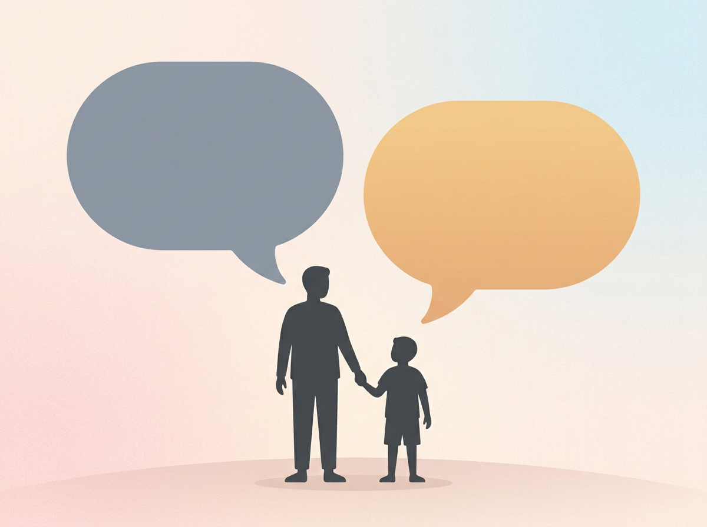

# Chapter 7: Growing a Growth Mindset at Home

---

## Part 3: Nurturing Without Pressure

---

You've spent the first half of this book learning how to *see* your child — their play patterns, their intelligence type, their emerging strengths. You've been watching, writing, and reflecting. You're starting to get a real picture of who this little person is and how their mind works.

Now comes the trickier part: **What do you do with what you've found?**

Because here's where most well-meaning parents make a mistake. They spot a talent — and they pounce on it. Sign up for classes. Buy the equipment. Set a practice schedule. Tell everyone at Thanksgiving that their kid is "really gifted in math" or "probably going to be an artist."

And slowly, without anyone noticing, the thing the child loved becomes the thing they have to do.

**This chapter is about how to avoid that trap.** It starts with one concept that, once you understand it, will change how you talk to your kid: the difference between a fixed mindset and a growth mindset.

---

## Fixed vs. Growth: The 2-Minute Explanation

Carol Dweck, a psychologist at Stanford, has spent over thirty years studying how people think about their own abilities. Her research has been replicated across cultures, age groups, and settings. The core finding:

**People who believe talent is fixed ("You're either smart or you're not") perform worse over time than people who believe talent is built ("You get better through effort").**

This isn't a motivational poster. It's one of the most replicated findings in psychology.

Here's what it looks like in children:

> | Fixed Mindset | Growth Mindset |
> |---|---|
> | "I'm smart" (identity) | "I worked hard on that" (process) |
> | Avoids challenges — might fail and lose the "smart" label | Seeks challenges — struggle means learning |
> | Gives up quickly when something is hard | Persists, asks for help, tries a different approach |
> | Feels threatened by others' success | Feels inspired or curious about others' success |
> | Believes mistakes mean "I'm not good at this" | Believes mistakes mean "I haven't figured this out yet" |

Here's the part that stings: **children as young as four can already have a fixed mindset.** And the biggest source of fixed mindset messaging in a child's life isn't school, media, or friends.

It's their parents.

Not because you're doing anything wrong. But because the most natural, loving thing a parent says — "You're so smart!" — is one of the most damaging phrases for long-term motivation.

---

## The Words That Help and the Words That Accidentally Hurt

This is where things get practical. The language you use with your child around their abilities shapes how they think about themselves for years. Small shifts in wording create big shifts in mindset.

**The problem with praising talent:**

When you say "You're so smart!" or "You're a natural!" you're telling your child that their ability is an innate thing they *have* — not something they *built.* That feels great in the moment. But the next time they face something hard, a quiet voice in their head says: *"If I were really smart, this wouldn't be hard. Maybe I'm not as smart as they think."*

And then they stop trying.

**The power of praising process:**

When you say "You worked really hard on that" or "I noticed you tried three different ways before it worked" — you're telling your child that their effort is what matters. The next time they face something hard, the voice says: *"This is hard, but that's what effort is for."*

And they keep going.

> *"Praising children's intelligence harms their motivation and performance."*
> — Carol Dweck, from a study published in the *Journal of Personality and Social Psychology*

This isn't theory. In Dweck's experiments, children who were praised for being smart chose easier tasks, performed worse on harder ones, and even lied about their scores to maintain the "smart" image. Children praised for effort chose harder tasks, performed better under difficulty, and told the truth about their results.

**Same kids. Same ability. Different words. Wildly different outcomes.**

[//]: # (IMAGE_PROMPT_START)
[//]: # (NANO_BANANA_2: "A clean, premium editorial flat vector illustration showing two speech bubbles side by side. The left bubble is in a cool, muted gray-blue tone. The right bubble is in a warm, golden-peach tone. Below the bubbles, a simple silhouette of a parent and child figure. Soft pastel background, minimalist design, no text inside the bubbles, no faces, warm and approachable editorial style, high quality.")
[//]: # (IMAGE_PROMPT_END)

---

## Praise the Process, Not the Product: A Practical Script

Here are real situations you'll find yourself in this week — and two ways to respond. One builds a fixed mindset. The other builds growth.

**Your child shows you a drawing:**
- Fixed: "Wow, you're such a great artist!"
- Growth: **"I love this. Tell me about it — what part took the longest?"**

**Your child gets a good grade:**
- Fixed: "See? You're so smart!"
- Growth: **"That's awesome. What did you do to prepare that worked so well?"**

**Your child wins a game:**
- Fixed: "You're a natural!"
- Growth: **"You played really well. I noticed you changed your strategy halfway through — that was clever."**

**Your child finishes a hard puzzle:**
- Fixed: "That was easy for you!"
- Growth: **"That took you a while, and you stuck with it. How does it feel to have finished?"**

**Your child fails at something:**
- Fixed: "It's okay, you're still smart."
- Growth: **"That didn't go the way you wanted. What would you try differently next time?"**

The growth responses take about two extra seconds. And they change everything.

---

## How to Respond When Your Child Says "I'm Not Good at This"

This will happen. Probably multiple times this month. Your child will hit a wall — in math, in sports, in a creative project, in a friendship — and they'll say some version of:

*"I can't do it."*
*"I'm not good at this."*
*"I'm stupid."*

Your instinct will be to reassure them: "No, you're great! You can do anything!" That feels right. But it actually dismisses their experience and teaches them that struggling is something to be talked out of — not worked through.

**Here's a better approach:**

1. **Acknowledge the feeling.** "I can see this is frustrating. That's real."
2. **Normalize the struggle.** "This is supposed to be hard. Hard means you're at the edge of what you can do — and that's where you grow."
3. **Add the word 'yet.'** "You can't do it *yet.* What's one small thing you could try?"
4. **Share your own struggle.** "I felt that same way when I was learning to [cook / drive / use a new tool at work]. It took me a while, too."

That one word, *"yet,"* turns a dead end into a path. Small word. Big shift.

> **Real Parent, Real Story — Rob & Mia, age 8**
>
> Mia had been working on a complicated friendship bracelet pattern for three days. On day three, she burst into tears and threw the whole thing across the room. "I'm horrible at this! I'll never get it right!"
>
> Rob sat down on the floor next to her. He didn't pick up the bracelet. He didn't say "You'll get it." He said: "That looks like it was really frustrating. How far did you get before it went wrong?"
>
> Mia sniffed and pointed. "All the way to the fifth row. Then it keeps twisting."
>
> "So you did five rows perfectly," Rob said. "That's five rows more than yesterday. Do you want to stop, or do you want to figure out row six?"
>
> Mia picked it back up. She figured out row six that evening. Not because Rob told her she could — but because he helped her see that she already had.

---

## 10 Growth Mindset Phrases to Put on Your Fridge

Print these out. Stick them where you'll see them every day. Use them until they become automatic.

1. **"You worked really hard on that."**
2. **"Mistakes mean you're learning something new."**
3. **"You can't do it *yet.*"**
4. **"What's one thing you could try differently?"**
5. **"I love watching you figure things out."**
6. **"That was tough — and you stuck with it."**
7. **"It's okay to not know. Let's find out together."**
8. **"What part are you most proud of?"**
9. **"Your brain gets stronger every time you try something hard."**
10. **"Tell me about the part that was hardest."**

---

## Try This Tonight

> **Try This Tonight — The Mindset Swap**
>
> 1. **Think of the last three times you praised your child.** Write them down. Were they talent-based ("You're so smart") or effort-based ("You worked really hard")?
> 2. **For each one, rewrite it** using the growth mindset script above.
> 3. **Pick one phrase from the fridge list** and commit to using it at least three times tomorrow.
> 4. **Notice what happens.** Does your child respond differently? Do they say more about what they did? Do they seem more willing to try something hard?
>
> This isn't about being perfect with your language overnight. It's about gradually shifting the soundtrack in your home from "be smart" to "keep growing."

---

## A Quick Note for Parents: This Applies to You, Too

Growth mindset isn't just for kids. It's for you.

If you've been reading this book and thinking, *"I've been saying the wrong things for years — I've already messed this up,"* — that's a fixed mindset thought. And it's not true.

You're here. You're reading. You're learning a new way to do something that matters to you. That's exactly what growth looks like.

**You can't change what you've already said. But you can change what you say next.** And your child will feel the difference immediately.

---

## Chapter 7 Quick Resources

- **Book:** *Mindset: The New Psychology of Success* by Carol Dweck — the full picture. Clear, engaging, and full of practical examples.
- **For younger kids:** *The Girl Who Never Made Mistakes* by Mark Pett and Gary Rubinstein — a picture book that gently introduces the idea that mistakes are normal and valuable.
- **For older kids (7–10):** *Your Fantastic Elastic Brain* by JoAnn Deak — teaches children that their brain grows when they try hard things. Written at a level they can understand and internalize.
- **Free resource:** Big Life Journal offers free printable growth mindset worksheets for kids — available on their website.

---

*Next up: Chapter 8 introduces Talent Stations — simple, low-cost activity zones you can set up at home to give your child's natural strengths room to grow. No expensive equipment required.*
