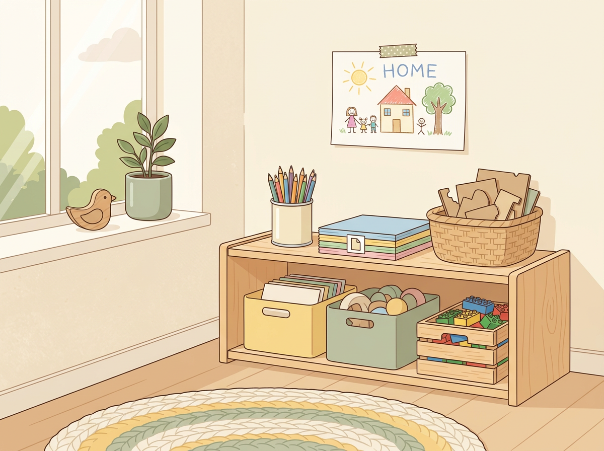
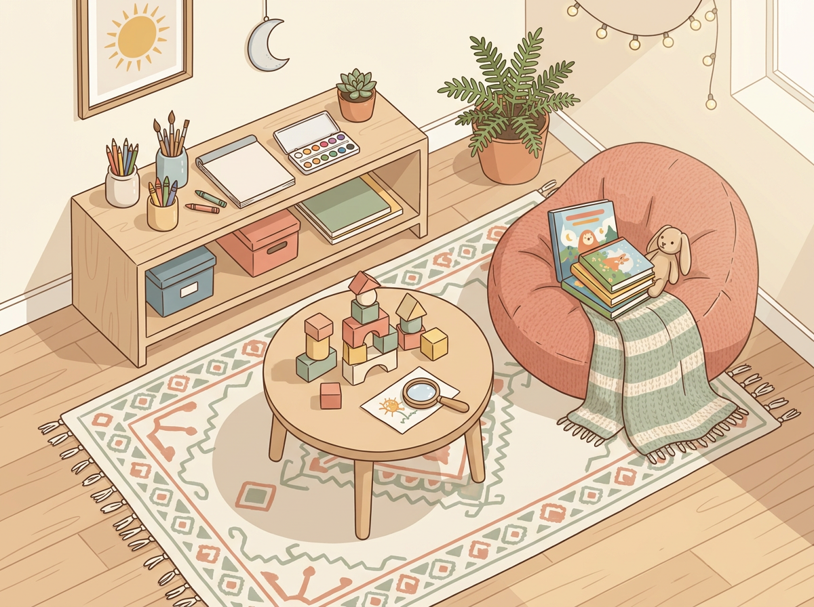

# Chapter 8: Talent Stations — Low-Cost, High-Impact Activity Zones

---

By now, you've identified your child's dominant play patterns, their likely intelligence types, and the activities that make them come alive. You've got Observer Notes, a checklist, and maybe a Preschooler Interest Map on the fridge.

Now the question is: **how do you create an environment at home that feeds those strengths — without spending a fortune or turning your living room into a classroom?**

The answer is something I call **Talent Stations.**

A Talent Station is a dedicated, always-available activity zone in your home: a corner, a shelf, a table, a bin, stocked with materials that match your child's natural strengths. It's not a lesson. It's not a scheduled activity. It's a place your child can walk up to and *start* whenever they feel the pull.

Think of it as a self-serve buffet for your child's brain.

> *"The environment is the third teacher."*
> — Loris Malaguzzi, founder of the Reggio Emilia approach

Malaguzzi's idea was simple: after the parent and the teacher, the physical space a child occupies is the most powerful influence on their learning. **A well-designed space invites engagement. A cluttered or empty space invites nothing.**

You don't need a Pinterest-worthy playroom. You need a corner with the right stuff in it.

---

## What Makes a Good Talent Station

A good Talent Station has four qualities:

1. **Accessible.** Your child can reach it without asking for help. Low shelves, open bins, nothing locked away.
2. **Open-ended.** The materials don't have one "right" use. Blocks, paper, clay, magnifying glasses — things that can become anything.
3. **Matched.** The station is designed around your child's dominant intelligence type, not your idea of what they should be doing.
4. **Rotated.** The materials change every 2–3 weeks so the station stays fresh without losing its purpose.

**The mistake most parents make:** Buying a bunch of stuff and dumping it in a play area. That's not a Talent Station. That's a toy graveyard. The key is **curation, not quantity.** Five well-chosen items beat fifty random ones.

---

## Station Setups by Intelligence Type

Below are station ideas for each of the eight intelligence types. You don't need to build all eight. **Start with one or two stations that match your child's strongest signals.** Expand later if you want to.

### Word Smart Station
- A journal or blank notebook
- A set of story dice or story prompt cards
- A small collection of books (rotate weekly)
- Magnetic letters for a fridge or whiteboard
- A kid-friendly voice recorder or an old phone set to "record" mode

**The idea:** Give them words to play with. Storytelling, writing, recording — any form of language output.

### Number Smart Station
- A set of pattern blocks or tangrams
- Simple card games (Uno, Set, Skip-Bo)
- A jar of mixed objects for sorting and counting
- A basic calculator (surprisingly fascinating to a Number Smart kid)
- Puzzle books — Sudoku, logic grids, or mazes

**The idea:** Give them patterns and problems. Let them sort, sequence, and solve.

### Picture Smart Station
- Drawing paper and a full set of colored pencils (not just crayons — the variety matters)
- Building materials: Legos, magnetic tiles, wooden blocks, cardboard + tape
- A simple camera or tablet for taking photos
- "How to draw" books — step-by-step visual guides
- Graph paper for designing floor plans, maps, or inventions

**The idea:** Give them a canvas. Let them see, build, and design.

> **Real Parent, Real Story — Rachel & Finn, age 6**
>
> Rachel set up a Picture Smart station on a low shelf in the hallway — nothing fancy. A stack of printer paper, a tin of colored pencils, a roll of tape, and a basket of cardboard scraps from Amazon boxes. She added a few Lego sets on the shelf below.
>
> The first week, Finn walked past it. The second week, he started drawing after school instead of asking for screen time. By the third week, he was combining materials — taping cardboard into shapes, then drawing details onto the surfaces. He built a "museum" of his own inventions and gave his parents a tour, complete with descriptions of each piece.
>
> Total cost of the station: about twelve dollars. Rachel has since rotated in new materials three times. Finn checks the station every day like it's a shop that might have new stock.

[//]: # (IMAGE_PROMPT_START)
[//]: # (NANO_BANANA_2: "A warm, premium editorial flat vector illustration of a cozy corner in a child's room with a low wooden shelf holding organized bins of art supplies — colored pencils in a tin, a stack of paper, cardboard scraps, and a small basket of Legos. A child's drawing is taped to the wall above. Soft natural light from a nearby window, pastel tones — warm cream, muted sage green, soft butter yellow, light wood tones. Clean, minimal, inviting. No text, high quality.")
[//]: # (IMAGE_PROMPT_END)

---

### Body Smart Station
- A designated movement area (even a small rug works)
- A jump rope, balance beam (a strip of tape on the floor works), resistance bands
- Playdough or modeling clay (fine motor)
- A simple obstacle course setup (pillows, cushions, a hula hoop)
- Threading and lacing activities for younger kids

**The idea:** Give them permission to move. Make physical engagement available, not forbidden.

### Music Smart Station
- A small keyboard, xylophone, or ukulele
- A rhythm set — shakers, tambourine, a drum pad
- A Bluetooth speaker with a curated playlist (let your child build the playlist)
- An empty notebook for writing songs or drawing "music" (many Music Smart kids invent their own notation)
- A basic recording app so they can listen back to what they create

**The idea:** Give them sound. Let them hear, create, and experiment with rhythm and melody.

### People Smart Station
- Board games and cooperative games (Outfoxed, Forbidden Island, Ticket to Ride Junior)
- Puppets or figurines for group storytelling
- A "mailbox" or message board where family members leave each other notes
- Interview cards: simple questions kids can use to "interview" family members or friends
- A scrapbook for collecting photos, ticket stubs, and memories of time spent with people

**The idea:** Give them connection. Let them organize, communicate, and engage with others.

### Self Smart Station
- A private journal with a lock (yes, this matters — even at age six)
- A feelings chart or mood tracker
- A cozy reading nook — a beanbag, a blanket, good lighting
- A "thinking box" — a small container where the child can put objects, drawings, or notes that represent how they feel
- A simple meditation or breathing exercise card (visual, not text-heavy)

**The idea:** Give them solitude and tools for self-reflection. Protect their inner world.

### Nature Smart Station
- A magnifying glass and a bug jar (with air holes)
- A nature journal — blank pages for drawing and pressing leaves, flowers, or feathers
- A bird identification card for your local area
- A small set of gardening tools and a pot with soil and seeds
- A collection tray — a flat container where they can arrange, sort, and display found natural objects

**The idea:** Give them the outdoors — or bring the outdoors in. Let them observe, collect, and care for living things.

---

## Rotation Schedules: Keeping It Fresh Without Overwhelming Anyone

A Talent Station only works if it stays interesting. Here's the simplest rotation approach:

**Every 2–3 weeks:**
- Remove 1–2 items that your child hasn't touched
- Add 1–2 new items that match the same intelligence type
- Move one item from a *different* intelligence type into the station — just to see what happens

**Monthly:**
- Take a photo of the station and your child's recent creations
- Note in your Observer journal which materials got the most use
- Ask your child: "Is there anything you wish was here?"

**Quarterly:**
- Reassess the station entirely. Has your child's dominant interest shifted? Should you change the focus? Add a second station?

The key is to **treat the station like a garden, not a museum.** It should be alive, changing, and responsive to what your child actually does — not what you planned.

---

## Room-by-Room Setup Guide

You don't need a spare room. You need a spare corner.

**Kitchen:** A Number Smart or Nature Smart station works perfectly here — sorting jars on the counter, a small herb garden on the windowsill, pattern blocks on the kitchen table.

**Living Room:** Word Smart or People Smart stations fit naturally — a bookshelf at kid height, a game shelf, a family message board.

**Bedroom:** Self Smart or Music Smart stations are best kept personal — a journal on the nightstand, a small keyboard in the corner, a reading nook.

**Hallway or Entryway:** Picture Smart or Body Smart stations — a low shelf of art supplies, a balance beam strip of tape on the floor, a jump rope by the door.

**Backyard or Balcony:** Nature Smart station — bug jars, a garden pot, a birdhouse, a collection tray.

> *"You don't need a bigger house. You need a more intentional one."*

---

## Try This Tonight

> **Try This Tonight — Build Your First Talent Station in 15 Minutes**
>
> 1. **Pick your child's strongest intelligence type** based on your observations so far.
> 2. **Choose a spot** in your home — a shelf, a corner, a section of table. It doesn't need to be big. Two square feet is enough.
> 3. **Gather 3–5 items** that match that intelligence type. Use what you already have — you probably don't need to buy anything.
> 4. **Arrange them neatly** so they look inviting, not cluttered. Leave empty space. The station should feel like an invitation, not an assignment.
> 5. **Don't announce it.** Don't say "I made you a special play area!" Just set it up and see if your child finds it. Watch what they do.
>
> If they ignore it for a few days, that's fine. If they walk up and start engaging, take note of *what* they reach for first and *how* they use it.

---

## What to Say / What Not to Say About the Talent Station

> | Instead of... | Try... |
> |---|---|
> | "I set this up for you — go play!" | *Say nothing. Let them discover it.* |
> | "Use the blocks to build a house." | *Leave the materials open. Let them decide.* |
> | "You haven't used your station today." | "I noticed you spent time at your station yesterday — what were you working on?" |
> | "That's not what those are for." | *Bite your tongue. If they're using art supplies to build a catapult, that's engineering.* |

---

## Chapter 8 Quick Resources

- **Book:** *Simplicity Parenting* by Kim John Payne — a powerful argument for reducing toy clutter and creating intentional spaces. Pairs perfectly with the Talent Station approach.
- **On a budget:** Dollar stores, thrift shops, and your recycling bin are your best friends. Cardboard, tape, string, old magazines, jars, rubber bands — all of it is valid station material.
- **Printable:** The Talent Station Setup Guide, organized by intelligence type with specific item suggestions, is available in the Appendix.

---

*Next up: Chapter 9 tackles the hard stuff — what to do when your child's interest turns into dread, when practice starts feeling like punishment, and how to tell the difference between healthy challenge and real burnout.*

[//]: # (IMAGE_PROMPT_START)
[//]: # (NANO_BANANA_2: "A warm, inviting editorial flat vector illustration showing a bird's-eye view of a child's room corner with three small, neatly organized stations: a low shelf with art supplies and colored pencils, a small table with building blocks and a magnifying glass, and a cozy beanbag with a few books beside it. Soft, warm afternoon light. Pastel tones — muted coral, soft sage, warm cream, light wood. Minimal, clean, organized but lived-in feel. No text, premium quality.")
[//]: # (IMAGE_PROMPT_END)

