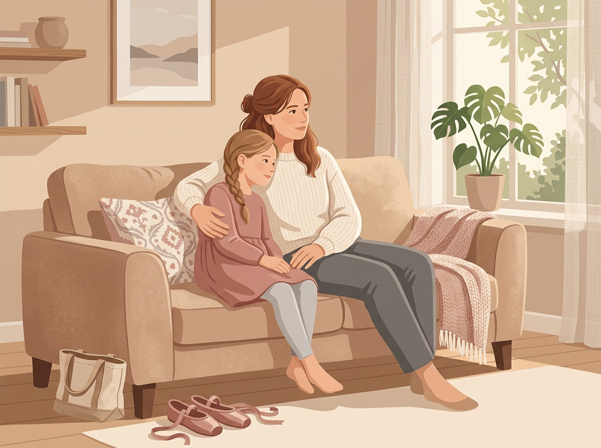

# Chapter 9: When It Stops Being Fun — Handling Burnout and Resistance

---

This might be the chapter I wish I'd read first as a parent. Not because it's exciting, but because it's the one that can save you from doing real harm with the best of intentions.

You've been watching your child. You've spotted their strengths. You've set up a Talent Station, practiced growth mindset language, and maybe even enrolled them in an activity that matches their natural wiring. Everything is going well.

And then, one morning, your child says: **"I don't want to go."**

Or they stop drawing. Or they leave the Legos untouched. Or they cry before soccer practice. Or they say the thing that hits you right in the chest: *"You only care about this because you think I'm good at it."*

What now?

---

## The Difference Between Healthy Challenge and Harmful Pressure

Not all resistance is burnout. Sometimes a child doesn't want to do something because it's hard — and pushing through that resistance is exactly how they grow. That's healthy challenge. We talked about it in Chapter 7.

But sometimes the resistance is a signal that something has gone wrong. The activity that once brought joy has become an obligation. The thing they loved has started to feel like a performance.

Here's how to tell the difference:

> | Healthy Challenge | Harmful Pressure |
> |---|---|
> | Child is frustrated but returns to the activity on their own | Child avoids the activity entirely |
> | Difficulty is coming from the task itself | Difficulty is coming from the expectations around the task |
> | Child still talks about the activity with energy or pride | Child goes silent about it — doesn't mention it at all |
> | Child asks for help or tries a different approach | Child shuts down, cries, or says "I hate this" |
> | After a break, they're ready to try again | After a break, they still don't want to go back |
> | The child chose to start and wants to continue | The child feels they can't quit because someone will be disappointed |

**Pay attention to that last row.** If your child feels they can't stop, not because they love it, but because they're afraid of letting you down, that's not nurturing a talent. That's pressure wearing a costume.

---

## Warning Signs That Your Child Is Burning Out

Burnout doesn't always look dramatic. It often creeps in quietly. Here are the signs to watch for:

- **Physical complaints before the activity.** Headaches, stomachaches, tiredness — especially when they only appear on lesson days or practice days.
- **Emotional flatness.** They used to light up about this thing. Now they just... do it. No excitement, no energy, no conversation about it.
- **Avoidance behaviors.** Stalling, "forgetting" equipment, suddenly needing to go to the bathroom every time it's time to leave.
- **Increased irritability.** The activity makes them more tense, not less. They come home from practice angry or withdrawn instead of energized.
- **Loss of creativity.** A child who used to improvise, invent, and experiment now just goes through the motions. They do what's asked and nothing more.
- **Sleep disruption or anxiety.** Having trouble sleeping before competition days or performance days. Talking about being "not good enough."

**Any one of these alone might just be a bad day. Three or more together, lasting weeks, is a pattern worth paying attention to.**

> **Real Parent, Real Story — Grace & Ava, age 9**
>
> Ava had been dancing since she was four. She loved it — begged for lessons, practiced in the living room, choreographed routines for her stuffed animals. By seven, she was in a competitive group. By eight, she was rehearsing four days a week.
>
> At nine, Grace noticed something had changed. Ava stopped practicing at home. She started saying she was "too tired" on rehearsal nights. She stopped talking about dance entirely — and when Grace brought it up, Ava changed the subject.
>
> Grace assumed Ava was going through a phase. She kept driving her to rehearsal. Then one evening, in the car, Ava said quietly: "Mom, I used to dance because I loved it. Now I dance because you signed me up and I don't want to waste your money."
>
> That sentence changed everything. Grace pulled Ava out of the competitive group that week. She enrolled her in a casual, no-competition dance class instead — one afternoon a week, no recitals, no pressure. Within a month, Ava was choreographing in the living room again.
>
> The talent hadn't disappeared. The joy had been crushed under the weight of expectation. Once the pressure lifted, the love came back.

---

## How to Pull Back Without Giving Up

Pulling back doesn't mean abandoning a talent. It means adjusting the environment so the child can reconnect with the *internal* motivation that started this in the first place.

**Step 1: Name what you're seeing.**
Talk to your child honestly but gently. "I've noticed you don't seem as excited about [activity] lately. I'm not upset — I just want to check in. How are you feeling about it?"

**Step 2: Listen without defending.**
If they say "I don't like it anymore," resist the urge to say "But you used to love it!" or "We already paid for the whole semester." Their experience is more important than your investment.

**Step 3: Offer a real choice.**
"Would you like to keep going, take a break, or try something different? Any of those is okay with me." And mean it. If you offer a choice but your tone or body language communicates that only one answer is acceptable, your child will feel it.

**Step 4: If they choose to stop, honor it.**
A break is not a failure. Many children who step away from an activity for a few months come back to it later with renewed energy. And some don't — because the interest has shifted, and that's how children are supposed to work.

**Step 5: Keep the door open.**
"If you ever want to come back to this, just say the word. No pressure." Leave the materials available. Don't dismantle the Talent Station. Let the option exist without the obligation.

[//]: # (IMAGE_PROMPT_START)
[//]: # (NANO_BANANA_2: "A gentle, warm editorial flat vector illustration of a parent and child sitting together on a couch, the child leaning slightly into the parent, both looking ahead (not at the viewer). A pair of ballet shoes sits on the floor nearby, untouched. Soft, muted tones — warm beige, dusty rose, light gray, cream. Gentle late-afternoon light from a window. The mood is calm and supportive, not sad. No text, premium editorial quality.")
[//]: # (IMAGE_PROMPT_END)

---

## Having the "Do You Still Love This?" Conversation

This is one of the most valuable conversations you can have with your child — and one most parents never initiate, because they're afraid of the answer.

Here's a script you can adapt:

> **"Hey, I want to ask you something, and there's no wrong answer. I promise I won't be upset no matter what you say.**
>
> **When you first started [activity], you really loved it. I could see it. I want to make sure you still feel that way — because this should be something that makes you happy, not something that makes you stressed.**
>
> **So tell me honestly: do you still love this? Do you like it but not love it? Or do you wish you could stop?"**

Then be quiet. Let them answer. Let the silence sit if they need time.

Whatever they say, respond with: **"Thank you for being honest with me. That helps me help you."**

That's it. No guilt. No negotiation. Just listening.

---

## Protecting Your Own Energy (Because You Matter Too)

Let's talk about you for a minute.

If your child's talent discovery has become a source of stress in your life — if you're exhausted from driving to lessons, anxious about whether you're doing enough, comparing your family to others, or spending money you don't have — **that matters.**

You cannot pour from an empty cup, and you cannot model a healthy relationship with effort and growth if you're running on fumes.

**Signs you might be burning out as a parent-coach:**
- You think about your child's activities more than your child does
- You feel personally disappointed when they don't perform well
- You've started comparing your child to other children — and feeling anxious about the results
- You resent the schedule but feel guilty about cutting back
- You've lost sight of whether *your child* is enjoying this or whether *you* need them to

**If any of this sounds familiar, it's time to ask yourself the same question you'd ask your child: "Do I still love this? Or has it become an obligation?"**

> *"Your child doesn't need a parent who does everything. They need a parent who's present — and you can't be present if you're depleted."*

It's okay to scale back. It's okay to say "We're doing too much and we need to simplify." It's okay to have a season where nobody is enrolled in anything and you all just... breathe.

**Your child's talent won't disappear because you took a month off.** But your relationship might suffer if you don't.

---

## Try This Tonight

> **Try This Tonight — The Honest Check-In (For You)**
>
> 1. Sit down for five minutes after the kids are in bed.
> 2. Write down every activity, class, lesson, and scheduled commitment your child currently has.
> 3. Next to each one, write **one of three letters:**
>    - **J** — My child genuinely enjoys this (Joy)
>    - **N** — Neutral — they go along with it but aren't excited
>    - **D** — They dread it, resist it, or it causes stress (Dread)
> 4. Now add a second letter for yourself:
>    - **E** — This is easy for me to manage (Easy)
>    - **H** — This is hard on my time, energy, or budget (Hard)
> 5. Look at the list. **Anything marked D + H needs to go.** Anything marked N + H deserves a serious conversation. Anything marked J + E is your sweet spot.
>
> This exercise takes five minutes and can save you months of unnecessary stress.

---

## What to Say / What Not to Say When Your Child Wants to Quit

> | Instead of... | Try... |
> |---|---|
> | "We already paid for this." | "Your happiness matters more than the money." |
> | "You can't just quit everything." | "Tell me what changed. I want to understand." |
> | "But you're so good at it!" | "Being good at something doesn't mean you have to keep doing it." |
> | "What will your coach/teacher think?" | "This is your decision. Other people's feelings are not your responsibility." |
> | "Fine, but you're not quitting." | "Let's take a break and see how you feel in a month." |

---

## Chapter 9 Quick Resources

- **Book:** *The Self-Driven Child* by William Stixrud and Ned Johnson — a research-backed guide to giving children a sense of control over their own lives. Directly addresses the pressure-performance trap.
- **Book:** *Simplicity Parenting* by Kim John Payne (recommended again here) — the chapter on reducing scheduled activities is especially relevant.
- **For you:** *Burnout: The Secret to Unlocking the Stress Cycle* by Emily Nagoski and Amelia Nagoski — not a parenting book, but a deeply practical guide to managing your own depletion. You'll be a better parent if you read it.

---

*This wraps up Part 3. You now know how to grow a mindset that supports talent, create an environment that feeds it, and pull back when the pressure gets too high. In Part 4, we put it all together into a step-by-step action plan — starting with a 30-day schedule you can begin this week.*
