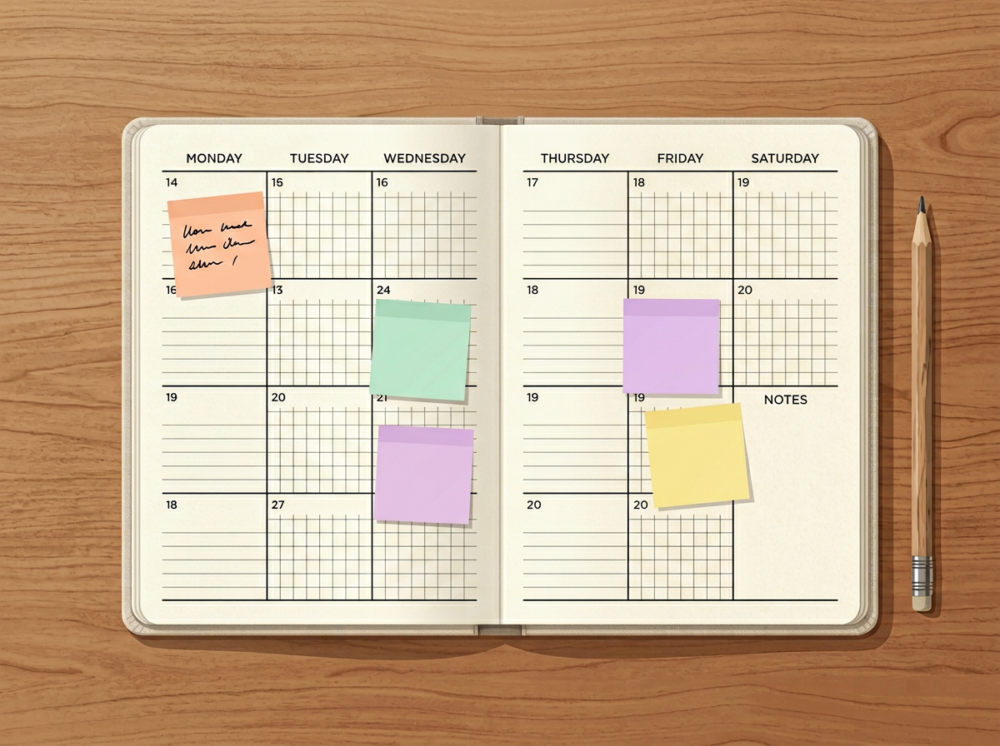
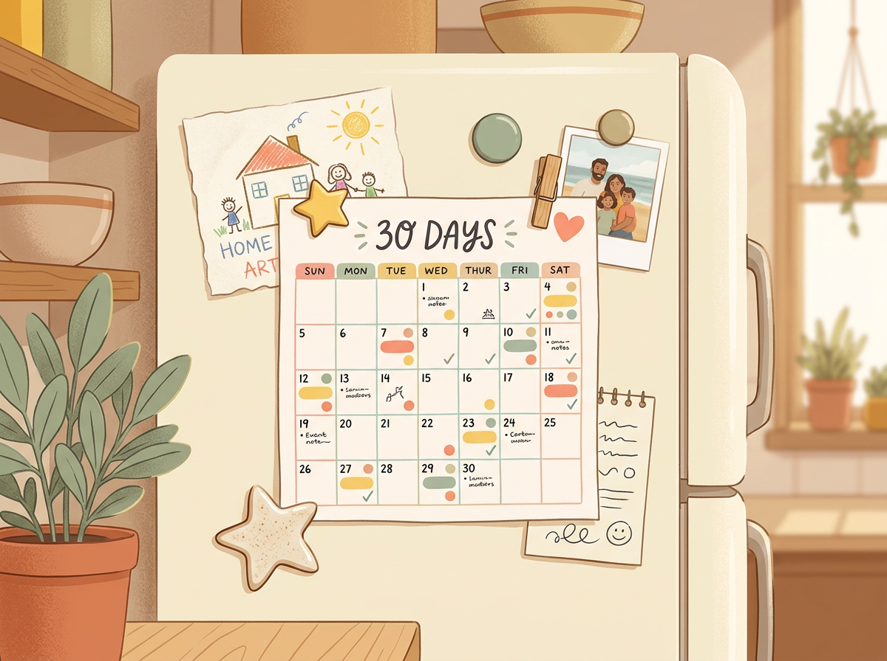

# Chapter 10: Your 30-Day Talent Discovery Schedule

---

## Part 4: The Parent's Action Plan

---

You've read the framework. You understand the play patterns, the intelligence types, the mindset shifts, and the warning signs. You have the tools.

Now it's time to use them.

This chapter gives you a simple, day-by-day schedule for the next thirty days. Each day has one small task — most take ten minutes or less. By the end of the month, you'll have:

- A detailed Observer journal with real, usable data about your child
- A clear picture of their dominant intelligence types
- At least one Talent Station set up in your home
- A growth mindset vocabulary that's becoming second nature
- Confidence that you're not guessing anymore — you're seeing

**You don't need to do this perfectly.** Miss a day? Skip it and pick up the next one. This isn't a test. It's a rhythm.

---

## Week 1: Observe

This week is about building the watching habit. Nothing else. Don't analyze, don't act, don't plan. Just notice.

**Day 1 — The First 10-Minute Watch**
Do a silent 10-minute observation during free play. Write 2–3 sentences about what you see. (You've already practiced this if you did the Chapter 1 exercise.)

**Day 2 — Sensory Scan**
Watch your child and note which senses they lean on most. Do they look at things closely (visual)? Touch everything (tactile)? Respond to sounds (auditory)? Move constantly (kinesthetic)?

**Day 3 — The Free Choice Test**
Give your child thirty minutes with no screens and no direction. Set out 3–4 different activity options. Note which one they choose first and how long they stay.

**Day 4 — Social Observation**
Watch your child with other kids — at a playdate, at the park, or with siblings. Note their social role. Leader? Peacemaker? Lone explorer? Observer?

**Day 5 — The Repetition Check**
Look back at your notes from Days 1–4. Is anything repeating? An activity, a preference, a behavior? Write it down.

**Day 6 — Rest Day**
No observation today. Take a break. Let your brain process what you've noticed so far.

**Day 7 — Weekly Reflection**
Spend five minutes reading through your notes. Ask yourself: *What keeps showing up? What surprised me?* Write a short summary paragraph.

> **Real Parent, Real Story — Lin & Ethan, age 5**
>
> Lin almost skipped Day 3 because "Ethan doesn't do anything interesting during free time." She did it anyway. What she saw: Ethan spent the entire thirty minutes rearranging the spice jars in the kitchen by height, then by color, then by "the ones that smell good and the ones that don't." He was sorting. Classifying. Organizing. Lin had been so focused on looking for dramatic creative expression that she'd missed the quiet, logical mind working right in front of her.

---

## Week 2: Experiment

This week is about gently introducing variety. You're not testing your child — you're expanding the menu to see what grabs their attention.

**Day 8 — Word Smart Test**
Give your child a blank notebook and say: "This is your story book. You can write in it, draw in it, or tell me a story and I'll write it down." Leave it with them. Note what they do.

**Day 9 — Number Smart Test**
Introduce a simple pattern game. Sort buttons by color, arrange coins by size, or play a basic card game. Watch how they engage with the logic of it.

**Day 10 — Picture Smart Test**
Give them building materials — blocks, Legos, cardboard, tape — with no instructions. Just: "Build whatever you want." Note what they make and how long they stay focused.

**Day 11 — Body Smart Test**
Set up a mini obstacle course — couch cushion stepping stones, a pillow to jump over, a line to balance on. Or put on music and say "Show me your best dance." Note their coordination and enthusiasm.

**Day 12 — Music Smart Test**
Play three different types of music (classical, pop, something rhythmic like drums). Watch their physical and emotional response. Do they move? Hum? Close their eyes? Get excited? Get calm?

**Day 13 — People Smart / Self Smart Test**
Offer your child a choice: "Do you want to play a game with me, or would you rather have some alone time to do whatever you want?" Don't guide the answer. Note what they choose and how quickly they decide.

**Day 14 — Weekly Reflection**
Review your experiment notes. Which tests got the strongest reaction? Which ones fell flat? Write down the top 2–3 intelligence types that showed up most clearly this week.

[//]: # (IMAGE_PROMPT_START)
[//]: # (NANO_BANANA_2: "A clean, warm editorial flat vector illustration of a weekly calendar or planner laid open on a wooden table, with colorful sticky notes on different days. A pencil rests beside it. Each sticky note is a different soft pastel color — peach, mint, lavender, butter yellow. Soft natural light from above, warm domestic feel. Clean white space around the edges, no readable text on the notes, premium editorial quality, high quality.")
[//]: # (IMAGE_PROMPT_END)

---

## Week 3: Identify

This is the week where the picture comes together. You've been collecting data for two weeks. Now you organize it.

**Day 15 — Fill In the Intelligence Spotter Checklist**
Pull out the checklist from Chapter 3 (or print a fresh one from the Appendix). Based on everything you've observed, rate each intelligence type: Rarely / Sometimes / Often.

**Day 16 — Create the Interest Map**
If your child is 4–6, build the Preschooler Interest Map from Chapter 5. If they're 7–10, do the Strengths Interview from Chapter 6. If they're under 4, review your sensory and play pattern notes and write a short summary: *"My child seems most drawn to..."*

**Day 17 — Play Pattern Review**
Look at your notes through the lens of the 5 Play Patterns from Chapter 2. Which patterns showed up most? Rank them from strongest to weakest.

**Day 18 — The Overlap Map**
On a blank piece of paper, write your child's top 2–3 intelligence types in circles. Below each, list the play patterns and specific activities that support them. Look for overlaps — activities that hit multiple strengths at once. These are your high-value activities.

**Day 19 — Share With Your Partner or Co-Parent**
If you have a parenting partner, share your findings today. Ask them: "Does this match what you see?" Two sets of eyes catch things one set misses.

**Day 20 — Talk to Your Child**
For children 5 and up: have a casual conversation about what they think they enjoy most. Use the Strengths Interview questions. For children under 5: skip this day or just observe one more session.

**Day 21 — Weekly Reflection**
Write a one-paragraph "portrait" of your child's strengths as you understand them right now. This is not a permanent label — it's a snapshot. You'll update it over time.

> *"You're not carving your child's identity in stone. You're sketching it in pencil — and pencil can always be erased and redrawn."*

---

## Week 4: Nurture

You know what you're looking at. Now you create the conditions for it to grow.

**Day 22 — Build Your First Talent Station**
Using the guides from Chapter 8, set up one Talent Station in your home. Match it to your child's dominant intelligence type. Start with 3–5 items.

**Day 23 — Introduce the Station**
Don't announce it. Don't force it. Just let your child discover it. Observe what happens. Write it down.

**Day 24 — Growth Mindset Practice**
Pick three phrases from the Chapter 7 fridge list. Use them intentionally today. Notice your child's response.

**Day 25 — The External Resource Search**
Spend fifteen minutes looking for one low-cost or free activity in your community that matches your child's strengths. A library program, a community class, a local club, a nature group. Just find it — don't sign up yet.

**Day 26 — The Budget Check**
Review what you've spent (or plan to spend) on your child's activities. Does the spending match their actual interests? Or are you funding obligations instead of passions? Use the J/N/D exercise from Chapter 9.

**Day 27 — Family Conversation**
At dinner, share something you noticed about each family member's strengths — including your own. Make it casual and positive. "I noticed that [child] is really good at [specific thing]. I think that's pretty cool."

**Day 28 — Station Rotation**
Swap one item in the Talent Station for something new. See if it changes what your child does there.

**Day 29 — Look Back**
Read through your entire Observer journal from Day 1 to today. Notice how much you've learned in four weeks. Write down the three biggest discoveries.

**Day 30 — Write Your Talent Discovery Letter**
Write a short letter to your child (they don't need to read it now — save it for later). Tell them what you've noticed about their strengths, what you admire about them, and what you hope for their future. Put it somewhere safe.

> **Real Parent, Real Story — Denise & Kai, age 7**
>
> Denise did the full thirty days. On Day 30, she wrote this in her letter to Kai:
>
> *"Dear Kai, This month I learned something about you that I always knew but never said out loud. You see the world differently than most people. You notice things — the way light hits a building, the shape of a crack in the sidewalk, the pattern on a butterfly's wing. You are Picture Smart and Nature Smart, and those two things together make you someone who sees beauty where other people see ordinary. I'm so glad I finally stopped to see what you see. Love, Mom."*
>
> She sealed it in an envelope and put it in a box on her closet shelf. She plans to give it to him when he turns eighteen.

---

## The Printable 30-Day Calendar

Below is a summary version you can print and stick on your fridge or inside a cabinet door.

| Day | Task | Time |
|---|---|---|
| 1 | 10-Minute Watch — free play observation | 10 min |
| 2 | Sensory Scan — which senses dominate? | 10 min |
| 3 | Free Choice Test — set out options, watch | 15 min |
| 4 | Social Observation — role in a group | 10 min |
| 5 | Repetition Check — review notes for patterns | 5 min |
| 6 | Rest Day | 0 min |
| 7 | Weekly Reflection — summary paragraph | 5 min |
| 8 | Word Smart Test — story book prompt | 10 min |
| 9 | Number Smart Test — pattern/sorting game | 10 min |
| 10 | Picture Smart Test — open-ended building | 15 min |
| 11 | Body Smart Test — obstacle course or dance | 10 min |
| 12 | Music Smart Test — play 3 music types, observe | 10 min |
| 13 | People/Self Smart Test — group vs. solo choice | 5 min |
| 14 | Weekly Reflection — top intelligence types | 5 min |
| 15 | Fill in Intelligence Spotter Checklist | 10 min |
| 16 | Create Interest Map or do Strengths Interview | 15 min |
| 17 | Play Pattern Review — rank the 5 patterns | 5 min |
| 18 | Overlap Map — find high-value activities | 10 min |
| 19 | Share findings with co-parent or partner | 15 min |
| 20 | Talk to your child (age 5+) | 10 min |
| 21 | Weekly Reflection — write a strengths portrait | 10 min |
| 22 | Build first Talent Station | 15 min |
| 23 | Let child discover the station — observe | 10 min |
| 24 | Growth mindset language practice | All day |
| 25 | Search for one external resource/activity | 15 min |
| 26 | Budget check — J/N/D exercise | 10 min |
| 27 | Family strengths conversation at dinner | 10 min |
| 28 | Rotate one item in the Talent Station | 5 min |
| 29 | Read full journal — note 3 biggest discoveries | 15 min |
| 30 | Write Talent Discovery Letter to your child | 15 min |

**Total time commitment over 30 days: approximately 5 hours.** That's less than ten minutes a day, on average, to build a deeply detailed understanding of your child's natural strengths.

[//]: # (IMAGE_PROMPT_START)
[//]: # (NANO_BANANA_2: "A warm, premium editorial flat vector illustration of a refrigerator door with a colorful 30-day calendar pinned to it with magnets. The calendar has small colored dots and checkmarks on various days. Around it are a child's drawing, a small photo, and a magnet shaped like a star. Soft warm kitchen lighting, pastel tones — butter yellow, soft coral, muted sage, cream. Close-up view, cozy domestic feel, no readable text, high quality.")
[//]: # (IMAGE_PROMPT_END)

---

## Try This Tonight

> **Try This Tonight — Commit to Day 1**
>
> Don't wait until next Monday. Don't wait for the "right time." Start tonight.
>
> 1. Open your phone's Notes app and create a new folder: **"Talent Discovery — [Child's Name]"**
> 2. Set a timer for 10 minutes.
> 3. Watch your child. Say nothing.
> 4. When the timer goes off, write 2–3 sentences.
>
> Congratulations. You just completed Day 1. Twenty-nine to go.

---

## Chapter 10 Quick Resources

- **Free printable:** The full 30-Day Talent Discovery Calendar (with daily prompts) is available in the Appendix.
- **App suggestion:** Use a simple habit-tracking app (Streaks, Habitica, or a paper habit tracker) to check off each day. The visual progress helps you stick with it.
- **Accountability tip:** Text a friend or partner on Day 1 and say: "I'm doing a 30-day observation challenge with my kid. Ask me how it's going on Day 15." External accountability doubles your odds of finishing.

---

*Next up: Chapter 11 — Budget-Friendly Talent Exploration. Because discovering your child's strengths shouldn't require a second income.*
