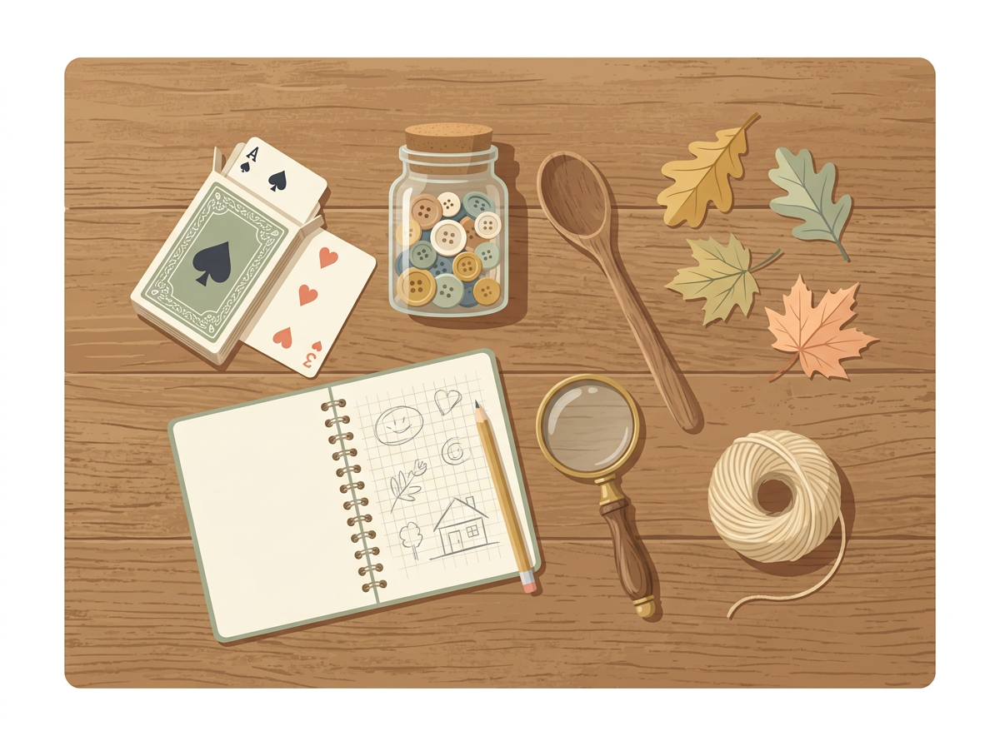
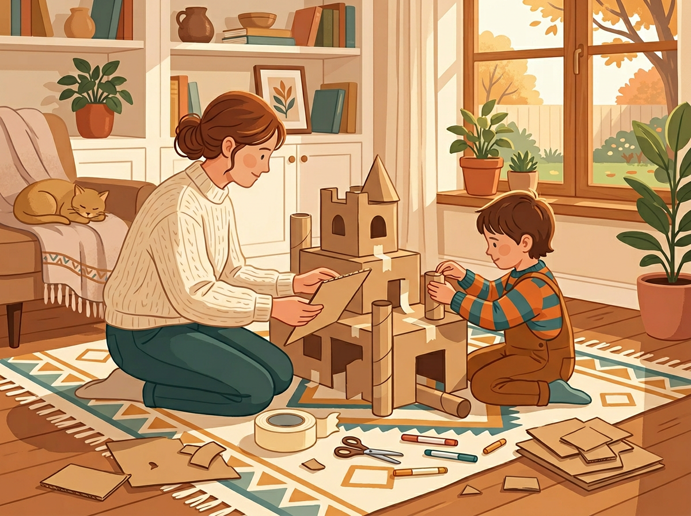

# Chapter 11: Budget-Friendly Talent Exploration

---

Let's address something that's probably been on your mind since Chapter 1:

**"This all sounds great, but I can't afford classes, tutors, and specialty programs."**

You don't need them.

The most useful tool in this book is free: your attention. The second, a Talent Station, can be built for under twenty dollars with stuff you already own. And the third, the 30-Day Schedule, costs nothing but ten minutes a day.

Talent discovery is not a premium product. It's a way of seeing. Everything you need to support what you find is either free, cheap, or already in your home.

This chapter is your budget-friendly guide to giving your child's strengths room to grow — without draining your bank account or your energy.

---

## The $0 Talent Discovery Kit: What You Already Have at Home

Before you spend a single dollar, do an inventory. You probably have more than enough to build a rich, engaging environment for your child right now.

**For the Word Smart child:**
- Scrap paper, junk mail envelopes, old notebooks — anything they can write or draw on
- Your phone's voice recorder app
- Library card (free access to thousands of books, audiobooks, and storytelling events)
- Dinner table conversation — the most underrated literacy tool in existence

**For the Number Smart child:**
- A deck of playing cards (dozens of math-based card games exist — search online for age-appropriate ones)
- A jar of buttons, coins, or pasta shapes for sorting and counting
- Kitchen measuring cups and a recipe — cooking is applied math
- Board games you already own (Monopoly, Yahtzee, Connect Four — all build logical thinking)

**For the Picture Smart child:**
- Printer paper and pencils
- Cardboard boxes, tape, scissors, rubber bands
- An old camera or phone in "camera mode"
- The recycling bin — an endless supply of building materials

**For the Body Smart child:**
- A jump rope (or a length of rope from the hardware store)
- Couch cushions and pillows for obstacle courses
- Music to dance to — any device with a speaker
- A strip of tape on the floor as a balance beam
- The backyard, a park, a sidewalk — free, open, and full of movement possibilities

**For the Music Smart child:**
- Pots, pans, wooden spoons, and containers with rice or beans inside (instant percussion kit)
- Free music on YouTube or Spotify
- Your own voice — singing with your child costs nothing and builds musical connection
- A free metronome app for rhythm games

**For the People Smart child:**
- Playdates (free)
- Board games and cooperative games
- Family meals where everyone talks and listens
- A "mailbox" made from a shoebox where family members leave each other notes

**For the Self Smart child:**
- A quiet corner and a blanket
- A notebook with a "Do Not Read" label (privacy is everything for this child)
- A walk alone in a safe space
- Questions like "How are you feeling?" — asked genuinely, not in passing

**For the Nature Smart child:**
- Your backyard, a park, a trail, a patch of grass
- A magnifying glass (available at most dollar stores)
- A jar for collecting specimens
- A blank notebook for nature drawings and leaf pressings

> *"The best learning materials aren't in a store. They're in your kitchen, your closet, and your recycling bin."*

[//]: # (IMAGE_PROMPT_START)
[//]: # (NANO_BANANA_2: "A warm, editorial flat vector illustration of a kitchen table seen from above, covered with everyday household items arranged as creative play materials: a deck of cards, a jar of buttons, a wooden spoon, a notebook, a magnifying glass, a ball of string, and a few leaves. Soft natural light, warm pastel tones — cream, muted gold, soft sage, light peach. Clean white background around the edges, no text, organized but casual feel, premium quality.")
[//]: # (IMAGE_PROMPT_END)

---

## Free and Low-Cost Activities Sorted by Intelligence Type

When you're ready to go beyond the home, here's where to look — organized by strength so you can match the activity to the child.

### Word Smart
- **Free:** Public library storytelling hours, reading challenges, and writing clubs
- **Free:** Start a family "book club" — pick a short book, everyone reads it, discuss at dinner
- **Low-cost:** A simple journal or composition notebook (under $3)
- **Free online:** Storybird, WriteReader, or NaNoWriMo's Young Writers Program

### Number Smart
- **Free:** Library-based coding clubs (many libraries now offer these)
- **Free:** Nature math — counting birds, measuring shadows, timing how long things take
- **Low-cost:** Puzzle books from a dollar store ($1–2)
- **Free online:** Khan Academy Kids (ages 2–8, fully free, no ads)

### Picture Smart
- **Free:** Community art nights or open studio events at local recreation centers
- **Free:** Architecture walks — explore your neighborhood and talk about building shapes and designs
- **Low-cost:** A sketchbook and a set of colored pencils ($5–8)
- **Free online:** YouTube "How to Draw" channels for kids (Art for Kids Hub is excellent)

### Body Smart
- **Free:** Parks, playgrounds, hiking trails, swimming holes
- **Free:** YouTube dance or yoga videos for kids (GoNoodle, Cosmic Kids Yoga)
- **Low-cost:** Community recreation center open gym or swim times (often $1–3)
- **Free:** Make-your-own obstacle courses using whatever you have

### Music Smart
- **Free:** YouTube instrument tutorials for beginners
- **Free:** Community concerts, school performances, church music programs
- **Low-cost:** A secondhand ukulele or keyboard from a thrift store ($5–15)
- **Free online:** Chrome Music Lab — a browser-based music creation tool from Google

### People Smart
- **Free:** Volunteer opportunities as a family (food banks, community cleanups, animal shelters)
- **Free:** Organize a neighborhood game day or playdate rotation
- **Low-cost:** Join a scout troop, 4-H club, or community youth group (often subsidized)
- **Free:** Give your child a "helper" role at home — assigning real responsibilities builds interpersonal confidence

### Self Smart
- **Free:** A daily "quiet hour" — protected alone time with no screens and no agenda
- **Free:** Walking — let your child take a solo walk (age-appropriate) or walk together in silence
- **Low-cost:** A journal with a lock ($5–8)
- **Free:** Guided meditation apps for kids (Insight Timer has a free kids' section)

### Nature Smart
- **Free:** Nature walks, park visits, creek exploration, cloud watching
- **Free:** Start a windowsill garden with seeds from a dried pepper or tomato
- **Low-cost:** A field guide to local birds or trees from a used bookstore ($2–5)
- **Free online:** iNaturalist app — lets kids photograph and identify plants and animals in their area

---

## Community Resources Most Parents Don't Know About

Your community probably has more free or subsidized programs for kids than you realize. Here's where to look:

- **Public libraries** — Beyond books, most libraries offer free STEM programs, craft workshops, storytelling events, coding clubs, and summer reading challenges. Many also lend out educational kits, science equipment, and musical instruments.

- **Parks and recreation departments** — Subsidized classes in sports, art, music, and nature education. Many offer sliding-scale fees or free programming for low-income families.

- **Community centers and YMCAs** — Free or low-cost open gym, swim, art, and youth programs. Financial assistance is almost always available if you ask.

- **Local museums** — Many offer free admission days, homeschool programs, and family workshops. Check for "community days" or "first Saturday free" events.

- **Homeschool co-ops and learning groups** — Even if your child attends regular school, some co-ops welcome part-time participants for group classes, field trips, and social events.

- **Churches, mosques, temples, and community organizations** — Many run free after-school programs, music groups, and mentorship programs open to all families regardless of membership.

> **Real Parent, Real Story — Tamara & Jaden, age 8**
>
> Tamara was a single mom working two jobs. She wanted to support Jaden's growing interest in science — he was the kid who wanted to take everything apart — but she couldn't afford the robotics classes his friends were attending.
>
> She asked at the public library. They had a monthly STEM club — free. She found a listing on her city's parks department website for a nature science camp — twelve dollars for the whole week, with scholarship spots available. She signed Jaden up for both.
>
> Then she did something simple: she started saving toilet paper rolls, egg cartons, and cardboard tubes. Every Saturday, she and Jaden spent an hour building "inventions" on the kitchen table. No instructions, no kits — just junk and tape and imagination.
>
> Jaden is now ten. He still talks about those Saturday build sessions as the best part of his week. The most expensive supply they ever used was a pack of hot glue sticks from the dollar store.

---

## The Power of "Enough"

Here's something the activity-industrial complex doesn't want you to know:

**Your child doesn't need more. They need enough.**

Enough attention. Enough space. Enough freedom to explore. Enough of the right materials — not all the materials.

A child with one good notebook and a parent who asks about their stories has more creative support than a child with a thousand-dollar art set and a parent who's too busy to look.

A child who explores the park every weekend with a curious, present adult has more science education than a child in an expensive STEM camp where they follow step-by-step instructions.

> *"It was never about the money. It was about the minutes."*

The minutes you spend watching. The minutes you spend listening. The minutes you spend sitting on the floor beside them, saying nothing, while they build something out of cereal boxes and tape.

Those minutes are the investment. Everything else is optional.

---

## Try This Tonight

> **Try This Tonight — The Household Treasure Hunt**
>
> 1. Walk through your home with fresh eyes. Open drawers, closets, the garage, the recycling bin.
> 2. **Collect 5 items** that could go into a Talent Station for your child — things you already have that match their dominant intelligence type.
> 3. Arrange them in a small, accessible spot.
> 4. Tomorrow morning, see if your child notices.
>
> Spend zero dollars. Invest ten minutes.

---

## Chapter 11 Quick Resources

- **Website:** Khan Academy Kids (free, ad-free, ages 2–8) — high-quality learning activities across all subjects
- **Website:** Your local library's event calendar — search "[your city] public library events children" for an updated list
- **Book:** *Last Child in the Woods* by Richard Louv — makes a powerful case for nature-based exploration and why it costs nothing to give your child what they most need
- **Printable:** The full Budget-Friendly Activity List, sorted by intelligence type, is available in the Appendix.

---

*Next up: the final section of this book — a letter to you, the parent who showed up, paid attention, and decided that seeing their child clearly was worth the effort.*

[//]: # (IMAGE_PROMPT_START)
[//]: # (NANO_BANANA_2: "A warm, cozy editorial flat vector illustration of a parent and child sitting together on a living room floor, building something out of cardboard boxes and tape. Cardboard scraps, scissors, and a roll of tape surround them. Both figures are slightly turned away from the viewer, focused on the project. Soft late-afternoon light from a window, warm pastel tones — golden amber, soft cream, muted teal, warm brown. Domestic, joyful, simple. No text, premium editorial quality.")
[//]: # (IMAGE_PROMPT_END)

