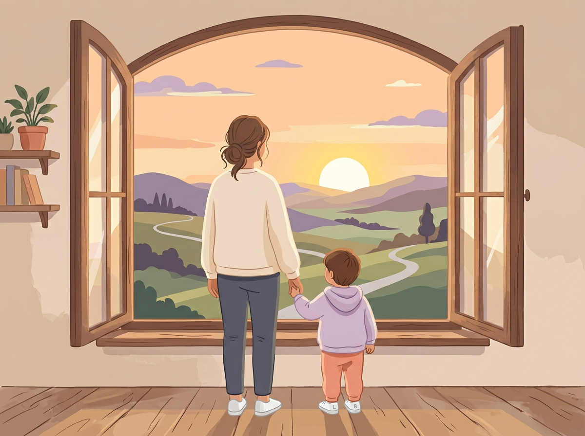

# Closing: A Letter to the Parent Who's Worried They're Not Doing Enough

---

Dear You,

I know why you picked up this book.

It wasn't because you don't care. It was because you care so much that the thought of missing something keeps you up at night. You lie in bed wondering if you should be doing more. More activities, more research, more structured learning, more *something*. The guilt just sits there.

So let me say this plainly:

**You are already doing the most important thing. You showed up. You paid attention.**

That is not a small thing. In a world full of noise (apps promising to raise your child's IQ, Instagram accounts showing you "perfect" parenting, friends who casually mention that their five-year-old is reading chapter books in Mandarin), you chose to slow down, look at *your* child, and ask the question that actually matters:

*Who are you, really? And how can I help you become more of that?*

That question is worth more than every class, program, tutor, and flashcard set on the planet.

---

## What You've Built in These Pages

If you've worked through this book — even imperfectly, even skipping sections, even reading it in messy, exhausted chunks during nap time — here's what you now have:

- **A way of seeing** your child that goes beyond grades, milestones, and comparison
- **A language** for understanding their natural strengths — not as labels, but as starting points
- **A set of practical tools** that fit into the life you already live
- **A mindset** that protects your child's joy and your own sanity
- **A 30-day habit** that, if you stick with it, will teach you more about your child than any assessment ever could

You don't need to be an expert. You never did. You just needed to know what to look for.

Now you do.

---

## The Long Game

Here's something I want you to remember on the hard days. The days when your child refuses to practice. When they change their mind about what they love for the third time this year. When you're too tired to observe anything except the inside of your own eyelids.

**Talent development is a long game. And you are playing it beautifully, even when it doesn't feel like it.**

The child who quits piano at eight might discover filmmaking at fourteen. The kid who can't sit still in second grade might become a phenomenal athlete in high school. The quiet girl who draws in her notebook while everyone else socializes might design buildings one day. Or graphic novels. Or surgical instruments. Or video games.

You can't see the end of the story yet. And that's okay.

What you *can* do, what you've been practicing across these chapters, is make sure your child feels seen, supported, and free enough to figure it out at their own pace.

> *"Your child doesn't need a parent who knows exactly where they're headed. They need a parent who walks beside them and says, 'I'm interested in where you're going.'"*

---

## You Don't Need to Be Perfect. You Need to Be Present.

You will say the wrong thing sometimes. You will accidentally praise talent instead of effort. You will sign them up for something they hate. You will miss an observation day. You will compare them to another kid when you promised yourself you wouldn't.

That's not failure. That's parenting.

**What matters is that you keep showing up.** With curiosity instead of anxiety. With openness instead of expectation. With the willingness to say: "Tell me more about that."

Your child doesn't need a perfect parent.

They need a present one.

And if you've read this far, you already are.

---

## One Last Thing

Somewhere in your home right now, your child is doing something. Maybe they're building with blocks. Maybe they're humming a song. Maybe they're staring out the window at a bird. Maybe they're arguing passionately about the rules of a made-up game.

Whatever it is, it means something.

Go watch.

---

With warmth and confidence in you,

**Amelia Sorrell**

[//]: # (IMAGE_PROMPT_START)
[//]: # (NANO_BANANA_2: "A warm, soft editorial flat vector illustration of a parent and child seen from behind, standing together at a large window, looking out at a gentle sunrise. The child is holding the parent's hand. Soft golden morning light fills the scene. Muted pastel tones — warm gold, soft peach, light lavender, cream. Peaceful, hopeful, quiet. Minimal detail, premium editorial quality, no text.")
[//]: # (IMAGE_PROMPT_END)

